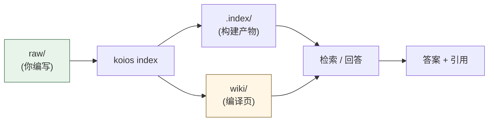
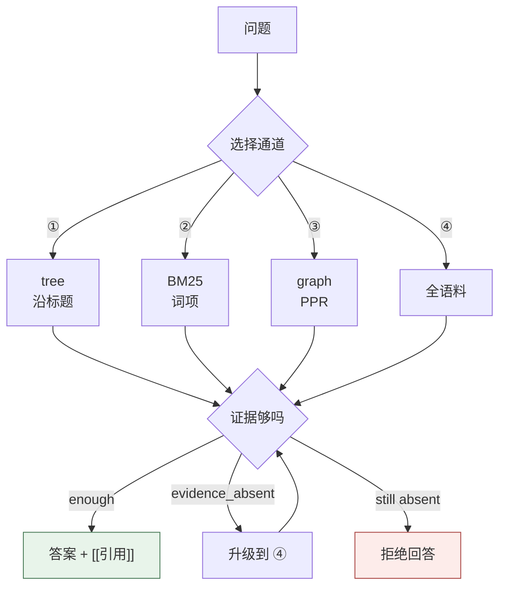
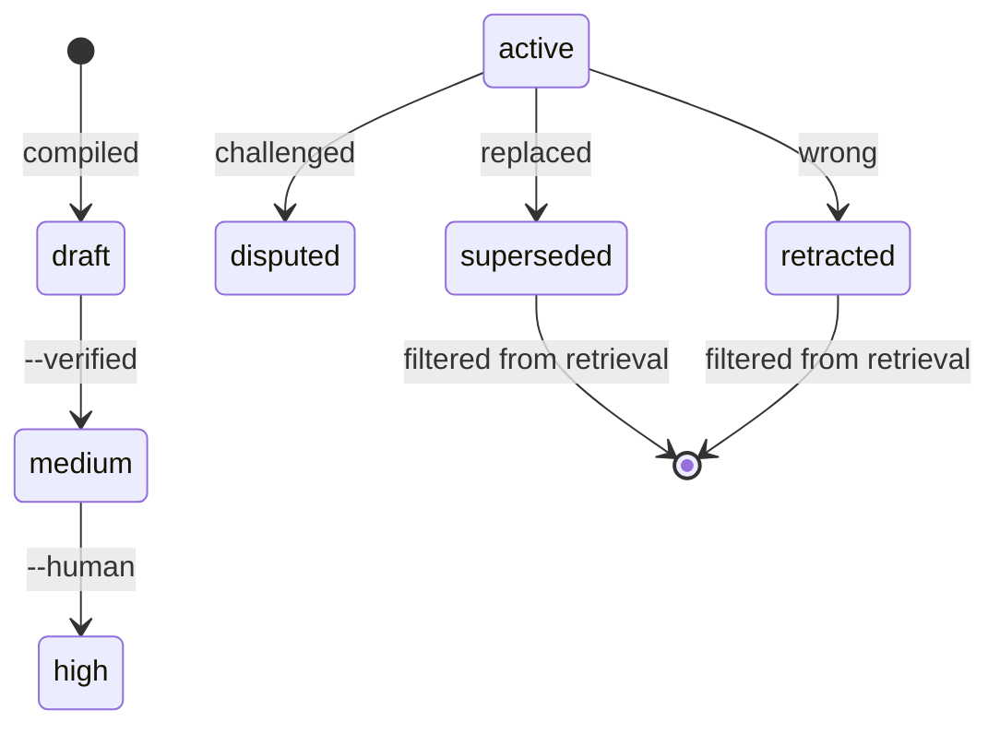

[](https://github.com/DeepTrial/KoiosBase/actions/workflows/ci.yml)
[](https://github.com/DeepTrial/KoiosBase/releases)
[](LICENSE)

[中文](README.md) | [English](docs/i18n/README.en.md) | [Français](docs/i18n/README.fr.md) | [Español](docs/i18n/README.es.md) | [日本語](docs/i18n/README.ja.md) | [한국어](docs/i18n/README.ko.md)

# KoiosBase

一个 Markdown 原生的 LLM 知识库。你写 Markdown，KoiosBase 建索引，
每个答案都指回它出自的那个块。

```console
$ koios search "revenue" -p myvault
[0] report.md#Financials/Revenue/1
    2024 Annual Report > Financials > Revenue
    ACME Corp revenue in 2024 was 3.2 billion yuan, up 12 percent.
[1] sources/report.md#2024 Annual Report/覆盖章节/1
    2024 Annual Report > 2024 Annual Report > 覆盖章节
    - Financials (`report.md#Financials`) - Revenue (`report.md#Financials/Revenue`) - Cash Flow (`report.md#Finan
[2] sources/report.md#2024 Annual Report/本文档能回答的问题/1
    2024 Annual Report > 2024 Annual Report > 本文档能回答的问题
    - 关于「Financials」，本文档有哪些说明？ (report.md#Financials) - 关于「Revenue」，本文档有哪些说明？ (report.md#Financials/Revenue) - 关于「
[3] sources/report.md#2024 Annual Report/导读摘要/1
    2024 Annual Report > 2024 Annual Report > 导读摘要
    ACME Corp revenue in 2024 was 3. 2 billion yuan, up 12 percent. Operating cash flow was positive for the year.
```

- **Markdown 就是事实本身。** 索引是构建产物，删掉会逐字节重建。
- **知识有生命周期。** 一个块被 `retracted`，所有引用它的页面标记 stale 并停止作答。



## 安装

单个 Rust 二进制，**无运行时依赖**。

```bash
curl -LO https://github.com/DeepTrial/KoiosBase/releases/latest/download/koios-linux-x86_64
chmod +x koios-linux-x86_64
# 或从源码构建（MuPDF bindgen 需要 libclang）
git clone https://github.com/DeepTrial/KoiosBase && cd KoiosBase
cargo build --release --manifest-path rust-cli/Cargo.toml
```

```console
$ koios init demo && koios index demo && koios lint demo
initialized KoiosBase vault at demo
indexed 0 blocks from demo
---- lint: 0 finding(s)
```

### 接入 LLM（可选）

不配置也能用：内置生成器只返回带引用的检索块，从不编造。想接模型就写
`koios config --init -p myvault`，然后填 `koios.toml`：

```toml
[model]
base_url = "https://api.openai.com/v1"
model = "gpt-4o-mini"
api_key_env = "OPENAI_API_KEY"     # 环境变量的「名字」，不是密钥本身
```

闸门对你的模型一样生效——缺引用会被报告而不是静默接受，模型失败是错误而不是编造的答案：

```console
$ koios query "revenue" -p myvault --llm-cmd 'printf "%s" "Revenue was 3.2 billion yuan."'
verdict: enough  hits: 3  escalated: false
Revenue was 3.2 billion yuan.
[contracts] citation=0/1 sentences cited
```

## 用法

```console
$ koios init myvault                            # 建 vault
$ koios index myvault                           # 每次编辑 raw/ 后跑
$ koios search "revenue" -p myvault             # 检索
$ koios query  "revenue" -p myvault             # 完整管线 + verdict
verdict: enough  hits: 4  escalated: false
[0] report.md#Financials/Revenue/1
    ACME Corp revenue in 2024 was 3.2 billion yuan, up 12 percent.
[1] sources/report.md#2024 Annual Report/覆盖章节/1
    - Financials (`report.md#Financials`)
- Revenue (`report.md#Financials/Revenue`)
- Cash Flow (`report.md#Finan
[2] sources/report.md#2024 Annual Report/本文档能回答的问题/1
    - 关于「Financials」，本文档有哪些说明？ (report.md#Financials)
- 关于「Revenue」，本文档有哪些说明？ (report.md#Financials/Revenue)
- 关于「
[3] sources/report.md#2024 Annual Report/导读摘要/1
    ACME Corp revenue in 2024 was 3. 2 billion yuan, up 12 percent. Operating cash flow was positive for the year.
$ koios compile -p myvault                      # 编译出结构化页面
compiled: entities=2 entity_pages=2 source_pages=1 affected_pages=5 stamp=2026-10-10
$ koios studio brief -p myvault -t revenue      # 导出
wrote myvault/wiki/synthesis/brief-revenue.md
$ koios mcp --install codex                     # 接 MCP 宿主
```

检索会按问题选通道，并在作答前先问证据够不够：



**ACL**：`--groups finance-team` 设定你的主体；不给就是匿名，受限文档对你不可见——这是设计。

**vault 结构**：`raw/`（你写）、`wiki/`（生成，要提交）、`.index/`（构建产物，别提交）。

## 维护

| 任务 | 命令 |
| --- | --- |
| 编辑 `raw/` 后 | `koios index myvault` |
| 健康检查 | `koios lint myvault` |
| 升级后 | `koios index myvault --full` |
| 事实错了 | `koios retract -p myvault -b "块id" --reason "..."` |
| 提升置信度 | `koios promote --human-confirmed "wiki/entities/acme.md"` |

```console
$ koios retract -p myvault -b "report.md#Financials/Revenue/1" --reason "wrong figure"
retracted report.md#Financials/Revenue/1; affected pages: 3 ["entities/acme-corp.md", "entities/acme.md", "synthesis/brief-revenue.md"]
```



confidence 只能靠生成器之外的证据提升（§5.4，绝不算引用数）：`draft → medium → high`。

## 文档

- `docs/KoiosBase设计文档v1.3.md` —— 设计基线
- `docs/python-rust-parity.md` —— 移植审计轨迹
- `docs/known-gaps.md` —— 已知缺口与限制
- `docs/i18n.md` —— 翻译规范
- `AGENTS.md` —— 写进每个 vault 的契约

MIT —— 见 [LICENSE](LICENSE)。
