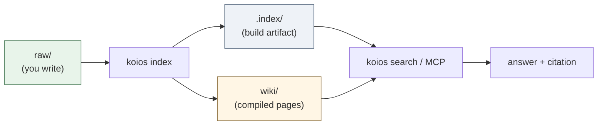
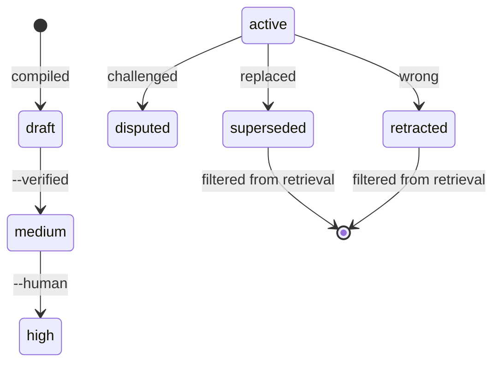
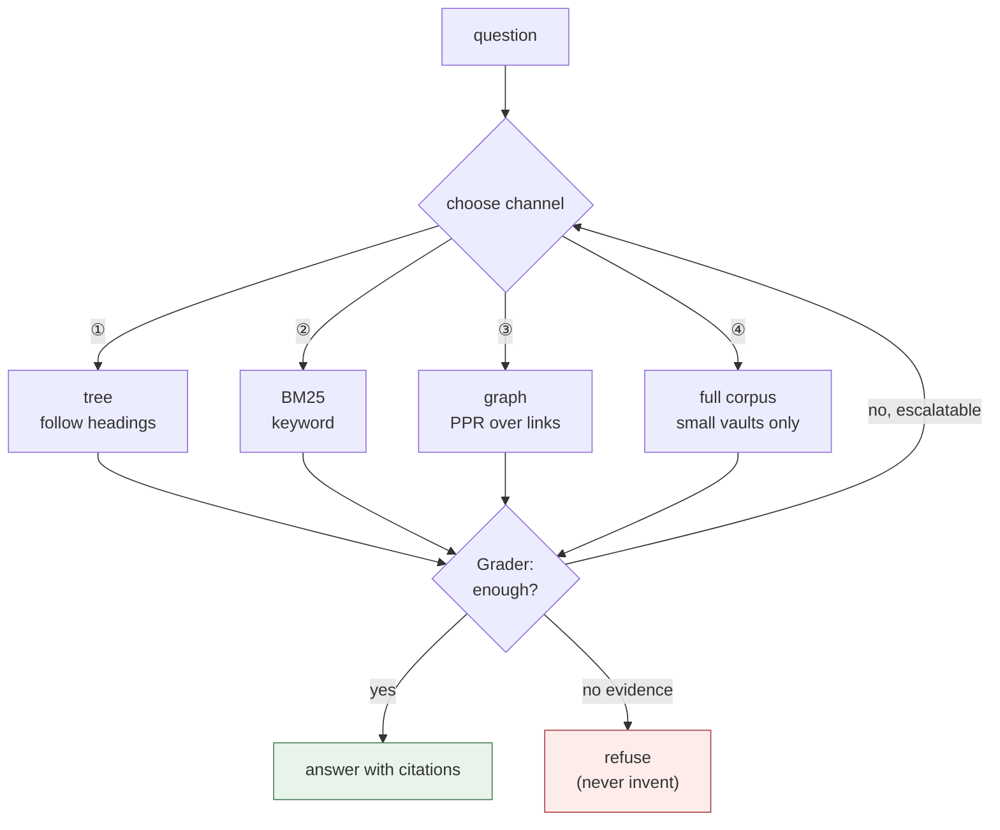

[](https://github.com/DeepTrial/KoiosBase/actions/workflows/ci.yml)
[](https://github.com/DeepTrial/KoiosBase/releases)
[](LICENSE)

[English](README.md) | [中文](i18n/README.zh.md) | [日本語](i18n/README.ja.md)

# KoiosBase

A Markdown-native knowledge base for LLMs. Your vault is a folder of Markdown
files: you write them, KoiosBase indexes them, and answers always come back with
a citation pointing at the exact block they came from.

```console
$ koios search "revenue" -p myvault
[0] report.md#Financials/Revenue/1
    2024 Annual Report > Financials > Revenue
    ACME Corp revenue in 2024 was 3.2 billion yuan, up 12 percent.
[1] sources/report.md#2024 Annual Report/覆盖章节/1
```

Every hit carries its block address and full breadcrumb, so you can quote it in
`[[wikilink]]` form and the link resolves.

Two things make it different from "chunk + embed + top-k":

- **Markdown is the truth.** The index is a build artifact — delete it and
  `koios index` rebuilds it byte-for-byte. Nothing important lives only in a
  database.
- **Knowledge has a lifecycle.** A block can be marked `retracted`, and that
  propagates: every page citing it is flagged stale, and it stops answering
  questions.

---

## How it works

Markdown in, cited answers out. The index is a build artifact, so the flow is
always one direction:



Trust accumulates in two ladders instead of one score. A compiled page starts
low and is only promoted by evidence the generator did not produce itself; a
block can be retracted, and that propagates to every page citing it.



Retrieval picks a channel rather than always doing the same thing, and asks
whether the evidence was enough before answering:



---

## Install

### Option A — pip (any OS, needs Python 3.10+)

```bash
pip install -e ".[test]"     # editable, from a clone
```

SQLite with FTS5 is bundled in CPython, so there is nothing else to install.

### Option B — prebuilt binary (no Python)

Each [release](https://github.com/DeepTrial/KoiosBase/releases) ships two
binaries:

| File | Platform |
| --- | --- |
| `koios-linux-x86_64` | Linux, static musl — runs anywhere |
| `koios-windows-x86_64.exe` | Windows x86-64 |

```bash
curl -LO https://github.com/DeepTrial/KoiosBase/releases/latest/download/koios-linux-x86_64
chmod +x koios-linux-x86_64
./koios-linux-x86_64 --help
```

### Verify

```bash
koios init demo && koios index demo && koios lint demo
# initialized KoiosBase vault at demo
# indexed 0 blocks from demo       <- empty vault, correct
# ---- lint: 0 finding(s)
```

---

## Usage

### 1. Create a vault

```bash
koios init myvault
```

```
myvault/
  raw/               your documents   <- you maintain this
  wiki/              compiled pages   <- generated, do not hand-edit
    sources/ answers/ entities/ concepts/ synthesis/
  .index/            build artifact   <- never commit
  AGENTS.md          the maintenance contract
```

### 2. Add documents

Drop Markdown or PDF files into `myvault/raw/`. Frontmatter is optional but is
where trust metadata lives:

```markdown
---
title: 2024 Annual Report
acl: [finance-team]        # optional: restrict to a group
ttl: 365d                  # optional: freshness window
valid_from: 2024-01-01
---

# Financials

## Revenue

ACME Corp revenue in 2024 was 3.2 billion yuan, up 12 percent.
```

Headings become the section tree; paragraphs become citable blocks.

### 3. Index

```bash
koios index myvault          # incremental, idempotent — run it freely
koios index myvault --full   # force a full rebuild
```

Run this after editing anything in `raw/`. It is safe to run repeatedly and
never grows the index on its own.

### 4. Search and ask

```bash
koios search "revenue" -p myvault                  # BM25 + graph, top 8
koios search "revenue" -p myvault -k 20            # more results
koios search "revenue" -p myvault -c tree          # force channel ①
koios search "revenue" -p myvault --groups finance-team
```

`-c` accepts `hybrid` (default), `tree`, `full`, `graph`. `--groups` sets your
ACL principal; without it you are anonymous and restricted documents are
invisible to you — by design, not by error.

### 5. Compile structured pages

```bash
koios compile -p myvault
# compiled: entities=2 entity_pages=2 source_pages=1 affected_pages=4 stamp=2026-09-30
```

Extracts entities into `wiki/entities/` and per-document reading guides into
`wiki/sources/`. Recompiling keeps a page's promoted confidence and any
human-authored notes.

### 6. Export

```bash
koios studio brief  -p myvault -t revenue   --groups finance-team
# wrote myvault/wiki/synthesis/brief-revenue.md
koios studio mindmap -p myvault -t Financials --groups finance-team
# wrote myvault/wiki/synthesis/mindmap-Financials.md
```

Note the flags: `-t/--topic` sets the subject, and the verb comes first. These
writes go to `wiki/synthesis/`. Exports add no new claims and carry citations, and
they respect ACL — an export is a file on disk, so a leak there outlives the
request.

### 7. Serve agents over MCP

```bash
koios mcp
```

Speaks JSON-RPC 2.0 over stdio and exposes `koios_search`, `koios_ask`,
`koios_write_answer`. No SDK dependency; works offline.

---

## Maintenance

### Daily

| Task | Command |
| --- | --- |
| After editing `raw/` | `koios index myvault` |
| Health check | `koios lint myvault` |

`koios lint` reports broken wikilinks, unsourced assertions, expired TTLs,
stale pages, and orphan pages. It is programmatic (L1) — no model involved, so
it is cheap enough to run in CI.

### Correcting a mistake

When a fact turns out to be wrong, **retract** it rather than editing around it:

```bash
koios retract -p myvault -b "report.md#Financials/Revenue/1" -r "wrong figure"
# retracted report.md#Financials/Revenue/1; affected pages: 2
# ['wiki/entities/acme-corp.md', 'wiki/entities/acme.md']
```

This does three things: the block stops answering questions (it is filtered out
of every retrieval path), every page citing it is marked stale, and the reason
is recorded. Search output may still *quote* the block's id inside a page that
cites it — that is a citation, not an answer. Pages whose sources moved on are
down-ranked and marked （待更新）.

### Promoting a compiled page

Compiled pages start at `confidence: draft`. Raising it requires evidence that
did not come from the generator itself (§5.4 — never citation counts):

```bash
cd myvault          # promote takes a filesystem path, not a vault-relative one
koios promote --verified "wiki/entities/acme.md"   # promoted: draft -> medium
koios promote --human    "wiki/entities/acme.md"   # promoted: medium -> high
```

`draft → medium → high`.

Note `promote` takes a **filesystem path relative to your current directory**,
unlike every other command — it has no `-p` flag, so `cd` into the vault first.
Without a flag it prints `not promoted (still draft): needs --verified or
--human` and exits 1. Promotion survives recompiling.

### Housekeeping

- **Never commit `.index/`.** It is derived; add it to `.gitignore`.
- **Commit `wiki/`.** Compiled pages are versioned Markdown, so review diffs
  like any other generated-but-tracked file.
- **Back up `raw/`.** That is the only irreplaceable directory.

### Upgrading

The index format is versioned with the code. After upgrading, re-run:

```bash
koios index myvault --full
```

---

## Concepts (short)

You can use KoiosBase without these, but they explain the output.

| Term | Meaning |
| --- | --- |
| **vault** | the root directory: `raw/` + `wiki/` + `.index/` |
| **block** | one citable paragraph or table, addressed as `doc.md#Section/1` |
| **layer** | `raw` (human-written) vs `wiki` (compiled) |
| **channel** | retrieval strategy: ① tree, ② BM25, ③ graph, ④ whole corpus |
| **state** | `active / superseded / disputed / retracted / draft` |
| **stale** | a compiled page whose sources changed; still usable, flagged |

Seven principles constrain every mechanism:

- **P1** Markdown is the single source of truth.
- **P2** Store the finest granularity; retrieve at any granularity.
- **P3** Retrieval is navigation and reasoning, never a similarity contest.
- **P4** Knowledge is synthesized at ingest, not recomputed per query.
- **P5** Knowledge has state; errors propagate and are repairable.
- **P6** Every assertion is auditable back to its source.
- **P7** The judge must differ in origin from the generator.

---

## Two shells, one vault

KoiosBase ships a Python implementation and a Rust one. Both read and write the
**same** vault format, so you can index with either and query with either.

Python is the reference implementation. The Rust binary covers the same command
surface and is checked against Python output on a shared fixture (block ids,
breadcrumbs, generated pages, MCP responses compared byte-for-byte).

```bash
# Python CLI, full surface
koios eval -p myvault              # eval baseline
koios eval -p myvault --strict     # count known semantic gaps as failures
koios checkclaim "revenue 3.2bn" "revenue was 3.2 billion yuan"
```

---

## Known gaps

Documented limits, not oversights. Read before relying on the system.

- **`needs_llm` cases.** `koios eval` reports a `needs_llm` count: questions
  where keywords hit but no real answer exists (mentioning 公司 ≠ answering a
  dividend-policy question). Needs the cross-family Grader of v0.3.
- **The L2 judge is a placeholder.** Decides only programmatic relations
  (numbers); everything else returns `unknown`.
- **Compile write set is O(corpus).** Correctness is solved; narrowing the
  writes is tracked debt.
- **Async recompile on stale is unimplemented.** Stale pages are disclosed and
  down-ranked, but the recompile is not auto-triggered (§5.3 forbids blocking
  availability on it).
- **The Windows binary is verified structurally only.** Valid PE32+, but no
  Windows runner or Wine was available to execute it.

---

## Layout

```
koiosbase/
  core/        Block / Section / Document model
  parsers/     Markdown + PDF adapters
  ingest/      raw + wiki -> derived index
  index/       SQLite schema (tree, blocks, FTS, links)
  retrieval/   BM25, RRF fusion, personalized PageRank
  generation/  citation + refusal contracts, judge
  compile/     entity + source pages, quality gate
  state/       knowledge state machine and cascade
  lint/        L1 gardener
  query/       retrieve -> assemble -> generate
  security/    ACL / multi-tenancy
  mcp/         JSON-RPC over stdio
  studio/      brief / mindmap exports
  cli.py       command-line interface
rust-cli/      the Rust shell (same vault format)
```

## Docs

- `docs/KoiosBase设计文档v1.3.md` — full design baseline (Chinese)
- `docs/i18n.md` — translation layout (see `i18n/`)
- `AGENTS.md` — the contract written into every vault

## License

MIT — see [LICENSE](LICENSE).
