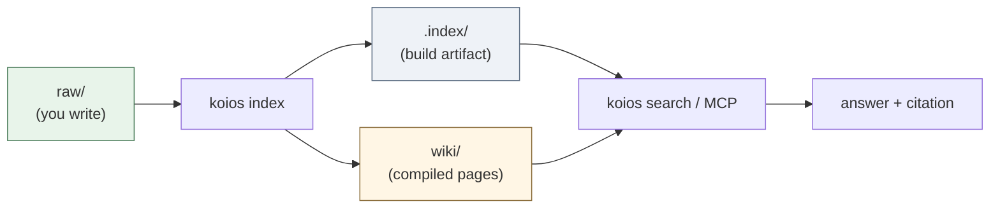
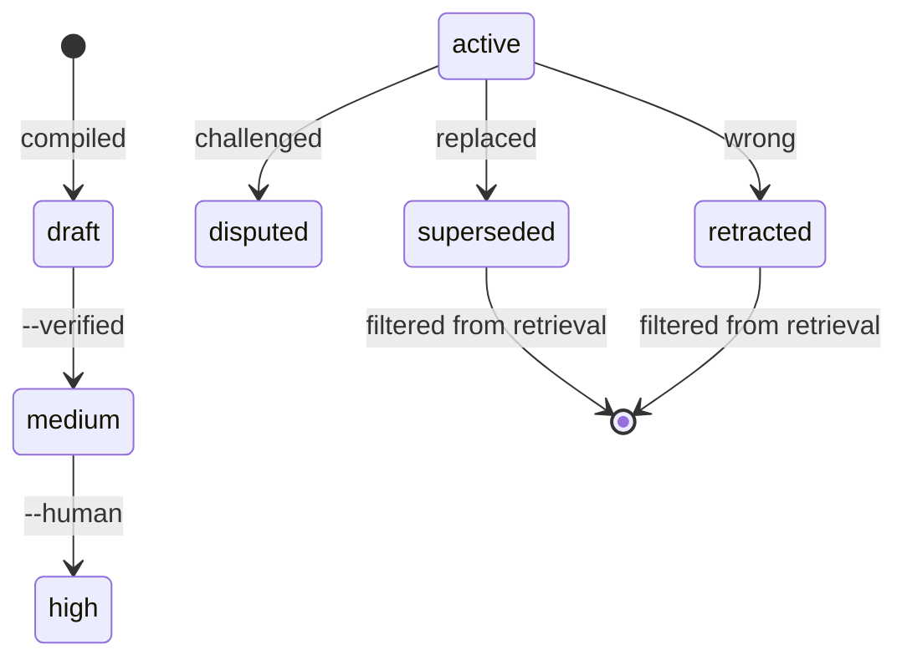
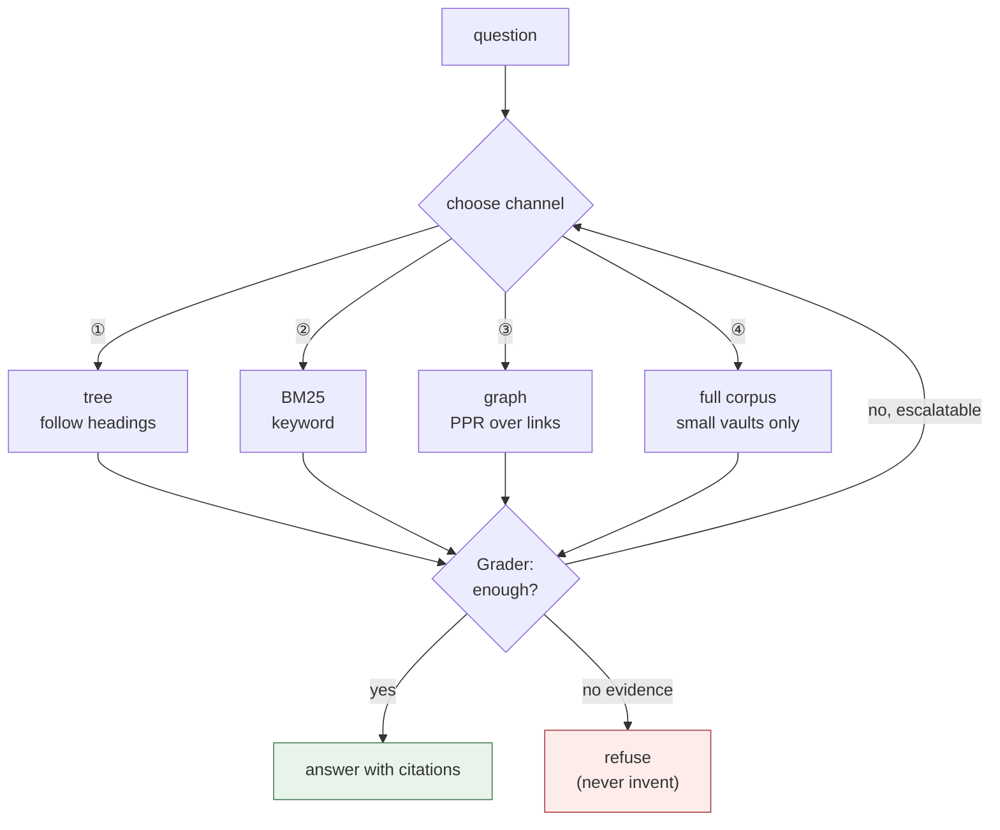

[](https://github.com/DeepTrial/KoiosBase/actions/workflows/ci.yml)
[](https://github.com/DeepTrial/KoiosBase/releases)
[](LICENSE)

[English](README.md) | [中文](i18n/README.zh.md) | [日本語](i18n/README.ja.md)

# KoiosBase

A Markdown-native knowledge base for LLMs. Your vault is a folder of Markdown
files: you write them, KoiosBase indexes them, and answers always come back with
a citation pointing at the exact block they came from.

```console
$ koios search "revenue" -p myvault
[0] report.md#Financials/Revenue/1
    2024 Annual Report > Financials > Revenue
    ACME Corp revenue in 2024 was 3.2 billion yuan, up 12 percent.
[1] sources/report.md#2024 Annual Report/覆盖章节/1
    2024 Annual Report > 2024 Annual Report > 覆盖章节
    - Financials (`report.md#Financials`) - Revenue (`report.md#Financials/Revenue`)
[2] sources/report.md#2024 Annual Report/导读摘要/1
    2024 Annual Report > 2024 Annual Report > 导读摘要
    ACME Corp revenue in 2024 was 3. 2 billion yuan, up 12 percent.
```

Every hit carries its block address and full breadcrumb, so you can quote it in
`[[wikilink]]` form and the link resolves.

Two things make it different from "chunk + embed + top-k":

- **Markdown is the truth.** The index is a build artifact — delete it and
  `koios index` rebuilds it byte-for-byte. Nothing important lives only in a
  database.
- **Knowledge has a lifecycle.** A block can be marked `retracted`, and that
  propagates: every page citing it is flagged stale, and it stops answering
  questions.

---

## How it works

Markdown in, cited answers out. The index is a build artifact, so the flow is
always one direction:



Trust accumulates in two ladders instead of one score. A compiled page starts
low and is only promoted by evidence the generator did not produce itself; a
block can be retracted, and that propagates to every page citing it.



Retrieval picks a channel rather than always doing the same thing, and asks
whether the evidence was enough before answering:



---

## Install

KoiosBase is a single Rust binary with **no runtime dependencies** — no Python,
no interpreter, no PyMuPDF. SQLite is compiled in via `rusqlite`'s bundled feature.

### Option A — prebuilt binary

Each [release](https://github.com/DeepTrial/KoiosBase/releases) ships two
binaries:

| File | Platform |
| --- | --- |
| `koios-linux-x86_64` | Linux, static musl — runs anywhere |
| `koios-windows-x86_64.exe` | Windows x86-64 |

```bash
curl -LO https://github.com/DeepTrial/KoiosBase/releases/latest/download/koios-linux-x86_64
chmod +x koios-linux-x86_64
./koios-linux-x86_64 --help
```

### Option B — build from source

```bash
git clone https://github.com/DeepTrial/KoiosBase && cd KoiosBase
cargo build --release --manifest-path rust-cli/Cargo.toml
./rust-cli/target/release/koios --help
```

`mupdf-sys` compiles MuPDF from source, so the build needs libclang for
bindgen: `sudo apt-get install clang libclang-dev` (Debian/Ubuntu).

### Verify

```console
$ koios init demo && koios index demo && koios lint demo
initialized KoiosBase vault at demo
indexed 0 blocks from demo
---- lint: 0 finding(s)
```

```bash
cargo test --release --manifest-path rust-cli/Cargo.toml   # 122 tests, green
```

---

## Usage

### 1. Create a vault

```bash
koios init myvault
```

```
myvault/
  raw/               your documents   <- you maintain this
  wiki/              compiled pages   <- generated, do not hand-edit
    sources/ answers/ entities/ concepts/ synthesis/
  .index/            build artifact   <- never commit
  AGENTS.md          the maintenance contract
  koios.toml         optional model config (see Connect an LLM)
```

### 2. Add documents

Drop Markdown or PDF files into `myvault/raw/`. Frontmatter is optional but is
where trust metadata lives:

```markdown
---
title: 2024 Annual Report
acl: [finance-team]        # optional: restrict to a group
ttl: 365d                  # optional: freshness window
valid_from: 2024-01-01
---

# Financials

## Revenue

ACME Corp revenue in 2024 was 3.2 billion yuan, up 12 percent.
```

Headings become the section tree; paragraphs become citable blocks.

### 3. Index

```bash
koios index myvault          # incremental, idempotent — run it freely
koios index myvault --full   # force a full rebuild
```

Run this after editing anything in `raw/`. It is safe to run repeatedly and
never grows the index on its own.

### 4. Search and ask

```bash
koios search "revenue" -p myvault                  # BM25 + graph, top 8
koios search "revenue" -p myvault -k 20            # more results
koios search "revenue" -p myvault -c tree          # force channel ①
koios search "revenue" -p myvault --groups finance-team
```

`-c` accepts `hybrid` (default), `tree`, `full`, `graph`. `--groups` sets your
ACL principal; without it you are anonymous and restricted documents are
invisible to you — by design, not by error.

### 5. Compile structured pages

```bash
koios compile -p myvault
# compiled: entities=2 entity_pages=2 source_pages=1 affected_pages=4 stamp=2026-09-30
```

Extracts entities into `wiki/entities/` and per-document reading guides into
`wiki/sources/`. Recompiling keeps a page's promoted confidence and any
human-authored notes.

### 6. Export

```bash
koios studio brief  -p myvault -t revenue   --groups finance-team
# wrote myvault/wiki/synthesis/brief-revenue.md
koios studio mindmap -p myvault -t Financials --groups finance-team
# wrote myvault/wiki/synthesis/mindmap-financials.md
```

Note the flags: `-t/--topic` sets the subject, and the verb comes first. These
writes go to `wiki/synthesis/`. Exports add no new claims and carry citations, and
they respect ACL — an export is a file on disk, so a leak there outlives the
request.

### 7. Serve agents over MCP

```bash
koios mcp
```

Speaks JSON-RPC 2.0 over stdio and exposes `koios_search`, `koios_ask`,
`koios_write_answer`. No SDK dependency; works offline.

---

## Connect an LLM

Out of the box KoiosBase answers from retrieved blocks alone — the built-in
generator returns the top three blocks with citations and never fabricates. That
is deliberate: the default must be trustworthy with zero configuration.

### Configure it once — `<vault>/koios.toml`

```bash
koios config --init -p myvault     # writes a starter file
$EDITOR myvault/koios.toml
```

```toml
[model]
# Any OpenAI-compatible endpoint: OpenAI, a local llama.cpp / vLLM / Ollama,
# or a corporate proxy.
base_url = "https://api.openai.com/v1"
model = "gpt-4o-mini"
api_key_env = "OPENAI_API_KEY"      # the NAME of the env var, never the key

# Optional: scanned PDF pages (§5.1 vision tier).
# [model.vision]
# model = "gpt-4o"

# Extra parameters go straight through to the provider.
temperature = 0.2

[retrieval]
top = 8
```

**The key is not in the file.** `api_key_env` names an environment variable and
the value is read at call time — a vault people commit must not become a
credential leak.

`koios config` shows what is actually wired up, including whether the key is
set — "is a model connected?" is otherwise unanswerable, since a typo leaves you
on the deterministic generator and that looks identical to a working setup that
merely found no evidence:

```console
$ koios config -p myvault
config: myvault/koios.toml
  chat: gpt-4o-mini @ https://api.openai.com/v1
  api key: $OPENAI_API_KEY (set)
  vision: (none) — scanned pages are skipped
  retrieval.top: 8
```

Every command that can use a model reads this file: `query`, `mcp`, and `index`
(for the vision tier). Nothing else changes — with no file, or no `[model]`
section, everything runs exactly as before.

There is no provider SDK in the codebase. `ureq` is a small HTTP client and the
wire format is the OpenAI chat shape, which is what local servers also speak; no
vendor is baked in. `model.command` is the escape hatch if you need something
that is not HTTP at all.

### The guardrails still apply

**Contracts are enforced on your model's output too** — handing KoiosBase a
model does not let it invent. An answer that omits citations is reported, not
silently accepted:

```console
$ koios query "revenue" -p myvault \
    --llm-cmd 'printf "%s" "Revenue was 3.2 billion yuan."'
verdict: enough  hits: 4  escalated: false
Revenue was 3.2 billion yuan.
[contracts] citation=0/1 sentences cited
```

A model that fails is an error, not a fabricated answer — including a key that
is not set:

```console
$ koios query "revenue" -p myvault
verdict: enough  hits: 4  escalated: false
model request failed: io: Connection refused (os error 111)

$ koios query "revenue" -p myvault       # api_key_env names an unset variable
verdict: enough  hits: 4  escalated: false
model config names api_key_env = "OPENAI_API_KEY" but that variable is not set
```

Retrieval stays authoritative — restricted documents are already gone before the
model sees anything, so it cannot leak what it was never given.

### From MCP

`koios mcp` reads the same file, so an agent launching the server gets the same
model as the CLI:

```bash
koios mcp
```

### Vision tier (scanned PDFs)

One more block in the same file, for pages with no extractable text:

```toml
[model.vision]
model = "gpt-4o"
```

Without it a scanned page contributes nothing — silently, by design. Inventing
text for a page nobody read is worse than not indexing it.
`rust-cli/tests/vlm_tier.rs` pins both halves of that behaviour.

### As a library

```rust
// Rust library API — the callable is an ordinary closure.
use koios::pipeline::{full_query_with, QueryResult};
use koios::connect;

let conn = connect(std::path::Path::new("myvault")).unwrap();
let my_llm = |question: &str, context: &str| -> Result<String, String> {
    Ok(call_your_model(context))     // OpenAI, Anthropic, local, anything
};
let result: QueryResult =
    full_query_with(&conn, "revenue", 8, Some(&["finance-team".into()]), Some(&my_llm));
println!("{}", result.answer);
println!("{:?}", result.violations);   // empty when the contracts hold
```

The callable contract is `Fn(&str, &str) -> Result<String, String>` (aliased as
`koios::pipeline::LlmFn`), and there is no provider adapter or API-key
configuration anywhere in the codebase — you supply the callable, so no vendor
is baked in. `koios::llm` is the CLI's own implementation of that contract:
`generate_with(cmd, question, context)` shells out and hands back the same
`Result`.

### What upgrading is meant to fix

The default extractive mode has two known weaknesses the LLM path addresses:
the `needs_llm` cases in `koios eval` (keywords hit, no real answer), and
cross-family judging (§P7 — the judge must differ in origin from the generator).
Both are listed under Known gaps.

---

## Maintenance


### Daily

| Task | Command |
| --- | --- |
| After editing `raw/` | `koios index myvault` |
| Health check | `koios lint myvault` |

`koios lint` reports broken wikilinks, unsourced assertions, expired TTLs,
stale pages, and orphan pages. It is programmatic (L1) — no model involved, so
it is cheap enough to run in CI.

### Correcting a mistake

When a fact turns out to be wrong, **retract** it rather than editing around it:

Real output:

```console
$ koios retract -p myvault -b "report.md#Financials/Revenue/1" --reason "wrong figure"
retracted report.md#Financials/Revenue/1; affected pages: 2
["wiki/entities/acme-corp.md", "wiki/entities/acme.md"]
$ cd myvault && koios promote --verified "wiki/entities/acme.md"
medium
```

This does three things: the block stops answering questions (it is filtered out
of every retrieval path), every page citing it is marked stale, and the reason
is recorded. Search output may still *quote* the block's id inside a page that
cites it — that is a citation, not an answer. Pages whose sources moved on are
down-ranked and marked （待更新）.

### Promoting a compiled page

Compiled pages start at `confidence: draft`. Raising it requires evidence that
did not come from the generator itself (§5.4 — never citation counts):

```bash
cd myvault          # promote takes a filesystem path, not a vault-relative one
koios promote --verified        "wiki/entities/acme.md"   # promoted: draft -> medium
koios promote --human-confirmed "wiki/entities/acme.md"   # promoted: medium -> high
```

`draft → medium → high`.

Note `promote` takes a **filesystem path relative to your current directory**,
unlike every other command — it has no `-p` flag, so `cd` into the vault first.
It prints the resulting tier (`draft`/`medium`/`high`); with neither
`--verified` nor `--human-confirmed` it simply re-reports the current tier.
Promotion survives recompiling.

### Housekeeping

- **Never commit `.index/`.** It is derived; add it to `.gitignore`.
- **Commit `wiki/`.** Compiled pages are versioned Markdown, so review diffs
  like any other generated-but-tracked file.
- **Back up `raw/`.** That is the only irreplaceable directory.

### Upgrading

The index format is versioned with the code. After upgrading, re-run:

```bash
koios index myvault --full
```

---

## Multimodal (vision) models

PDFs are parsed in two tiers (§5.1): a CPU text tier that is always available,
and a **VLM tier** that kicks in only when a page looks scanned — an image with
no extractable text.


The VLM tier matters because OCR-free pipelines silently lose scanned pages: a
contract scanned to PDF becomes invisible to keyword search and to every answer,
with no error to tell you. Handing the page image to a vision model recovers it,
and the recovered text carries the same page-level citations as the CPU tier.

It is one block in `koios.toml` (see Connect an LLM). Supplied as a library
callable, it receives **PNG bytes**, not a path:

```rust
// Rust library API — the callable receives PNG bytes, not a path.
use koios::pdf::extract_pages;

let my_vlm = |_path: &str, png: &[u8]| -> Result<String, String> {
    Ok(vision_model_transcribe(png))
};
let pages = extract_pages(std::path::Path::new("scan.pdf"), Some(&my_vlm));
```

Real output (a 2-page PDF; the CPU tier has text so the VLM stub is not invoked,
which is exactly what the two-tier design is supposed to do):

```console
$ cargo run --release --manifest-path rust-cli/Cargo.toml \
    --example readme_vlm_snippet -- scan.pdf
2 page(s) extracted
```

Two honest caveats, because this tier is easy to over-promise:

- **A scanned page with no `[model.vision]` configured contributes nothing** —
  silently. That is the intended default: inventing text for a page nobody read
  is worse than not indexing it.
- **Rasterization comes from the bundled MuPDF**, the same dependency every PDF
  read already uses, so there is nothing extra to install.

`rust-cli/tests/vlm_tier.rs` pins all three behaviours end to end: silent
without a command, recovered with one, and a failing vision command must not
lose the rest of the document.

Multimodal input beyond PDF — images, charts, screenshots as first-class sources
— is not implemented. KoiosBase is Markdown-native (P1); vision enters only as
the recovery path when text extraction fails.

---

## Concepts (short)


You can use KoiosBase without these, but they explain the output.

| Term | Meaning |
| --- | --- |
| **vault** | the root directory: `raw/` + `wiki/` + `.index/` |
| **block** | one citable paragraph or table, addressed as `doc.md#Section/1` |
| **layer** | `raw` (human-written) vs `wiki` (compiled) |
| **channel** | retrieval strategy: ① tree, ② BM25, ③ graph, ④ whole corpus |
| **state** | `active / superseded / disputed / retracted / draft` |
| **stale** | a compiled page whose sources changed; still usable, flagged |
| **VLM tier** | vision-model recovery for PDF pages with no extractable text |

Seven principles constrain every mechanism:

- **P1** Markdown is the single source of truth.
- **P2** Store the finest granularity; retrieve at any granularity.
- **P3** Retrieval is navigation and reasoning, never a similarity contest.
- **P4** Knowledge is synthesized at ingest, not recomputed per query.
- **P5** Knowledge has state; errors propagate and are repairable.
- **P6** Every assertion is auditable back to its source.
- **P7** The judge must differ in origin from the generator.

---

## One shell

KoiosBase began as a Python reference implementation and was ported to Rust.
The Rust binary is now the **only** shell in the repository: same vault format,
same command surface (16 subcommands), and no runtime dependencies. The PDF tier
links MuPDF under AGPL-or-commercial — the same position PyMuPDF already gave
the project, since that was its single runtime dependency. The Python tree and
the diff tools that proved the port live on in `docs/python-rust-parity.md` as
the audit trail, not as a second runtime.

Every parity claim above was produced by diffing the two implementations against
each other on non-empty fixtures — `docs/python-rust-parity.md` lists the method
and the reproducible commands.

Real output on the fixture used by `tests/channels_eval.rs`:

```console
$ koios eval -p myvault
total=5 recall@1=0.600 refusal_acc=1.000 citation_cov=0.348 needs_llm=0
$ koios checkclaim "revenue 3.2bn" "revenue was 3.2 billion yuan"
entailed
```

---

## Known gaps

Documented limits, not oversights. Read before relying on the system.

- **`needs_llm` cases.** `koios eval` reports a `needs_llm` count: questions
  where keywords hit but no real answer exists (mentioning 公司 ≠ answering a
  dividend-policy question). Needs the cross-family Grader of v0.3.
- **The L2 judge is a placeholder.** Decides only programmatic relations
  (numbers); everything else returns `unknown`.
- **Compile write set is O(corpus).** Correctness is solved; narrowing the
  writes is tracked debt.
- **Async recompile on stale is unimplemented.** Stale pages are disclosed and
  down-ranked, but the recompile is not auto-triggered (§5.3 forbids blocking
  availability on it).
- **The Windows binary is verified structurally only.** Valid PE32+, but no
  Windows runner or Wine was available to execute it.

---

## Layout

```text
KoiosBase/
  rust-cli/
    src/
      lib.rs        block model, parser, indexer, connect()
      ingest.rs     raw + wiki -> derived index
      pdf.rs        MuPDF-backed PDF adapter (CPU + VLM tiers)
      retrieval.rs  BM25, RRF fusion, personalized PageRank
      pipeline.rs   retrieve -> assemble -> generate, contracts
      compile.rs    entity + source pages, quality gate, synthesis
      state.rs      knowledge state machine and cascade
      lint.rs       L1 gardener
      acl.rs        ACL / multi-tenancy
      mcp.rs        JSON-RPC over stdio
      studio.rs     brief / mindmap exports
      main.rs       command-line interface
    examples/       runnable snippets quoted in this README
    tests/          19 integration suites (136 tests)
  docs/             design baseline, i18n layout, parity audit
  i18n/             this README in Chinese and Japanese
```

## Docs

- `docs/KoiosBase设计文档v1.3.md` — design baseline (Chinese); the v1.4 header
  notes where the shipped Rust binary deviates from it
- `docs/i18n.md` — translation layout (see `i18n/`)
- `AGENTS.md` — the contract written into every vault

## License

MIT — see [LICENSE](LICENSE).
