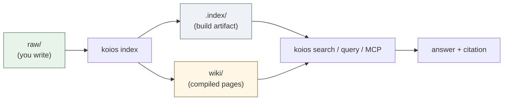
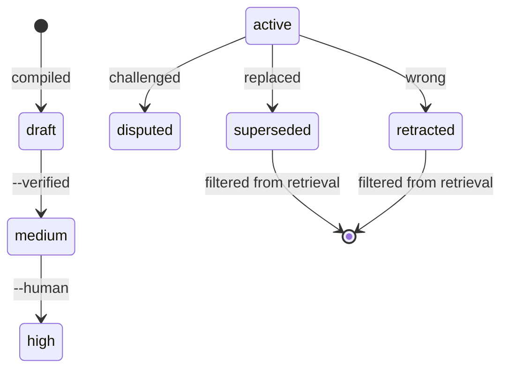
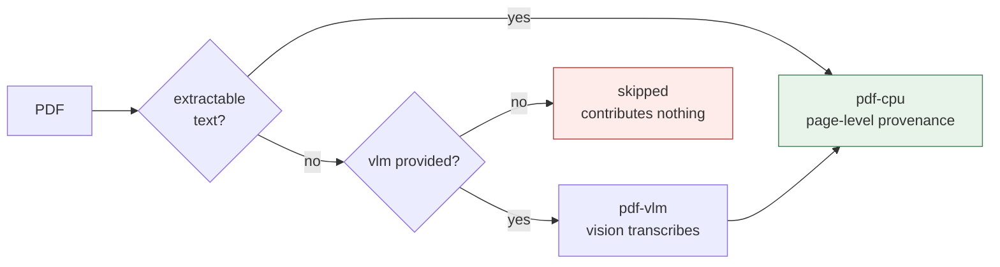

[](https://github.com/DeepTrial/KoiosBase/actions/workflows/ci.yml)
[](https://github.com/DeepTrial/KoiosBase/releases)
[](LICENSE)

[English](README.md) | [中文](docs/i18n/README.zh.md) | [日本語](docs/i18n/README.ja.md)

# KoiosBase

A Markdown-native knowledge base for LLMs. You write Markdown, KoiosBase indexes
it, and every answer comes back pointing at the exact block it came from.

```console
$ koios search "revenue" -p myvault
[0] report.md#Financials/Revenue/1
    2024 Annual Report > Financials > Revenue
    ACME Corp revenue in 2024 was 3.2 billion yuan, up 12 percent.
[1] sources/report.md#2024 Annual Report/覆盖章节/1
    2024 Annual Report > 2024 Annual Report > 覆盖章节
    - Financials (`report.md#Financials`) - Revenue (`report.md#Financials/Revenue`) - Cash Flow (`report.md#Finan
[2] sources/report.md#2024 Annual Report/本文档能回答的问题/1
    2024 Annual Report > 2024 Annual Report > 本文档能回答的问题
    - 关于「Financials」，本文档有哪些说明？ (report.md#Financials) - 关于「Revenue」，本文档有哪些说明？ (report.md#Financials/Revenue) - 关于「
[3] sources/report.md#2024 Annual Report/导读摘要/1
    2024 Annual Report > 2024 Annual Report > 导读摘要
    ACME Corp revenue in 2024 was 3. 2 billion yuan, up 12 percent. Operating cash flow was positive for the year.
```

Two things separate it from "chunk + embed + top-k":

- **Markdown is the truth.** The index is a build artifact — delete it and
  `koios index` rebuilds it byte-for-byte. Nothing important lives only in a
  database.
- **Knowledge has a lifecycle.** Mark a block `retracted` and it propagates:
  every page citing it is flagged stale, and it stops answering questions.



---

## Install

A single Rust binary with **no runtime dependencies** — SQLite is bundled in.

```bash
# Option A — prebuilt binary
curl -LO https://github.com/DeepTrial/KoiosBase/releases/latest/download/koios-linux-x86_64
chmod +x koios-linux-x86_64

# Option B — build from source (needs libclang for MuPDF bindgen)
git clone https://github.com/DeepTrial/KoiosBase && cd KoiosBase
cargo build --release --manifest-path rust-cli/Cargo.toml
```

```console
$ koios init demo && koios index demo && koios lint demo
initialized KoiosBase vault at demo
indexed 0 blocks from demo
---- lint: 0 finding(s)
```

---

## Usage

**1. Create a vault** — `koios init myvault`

```text
myvault/
  raw/          your documents        <- you maintain this
  wiki/         compiled pages        <- generated, don't hand-edit
  .index/       build artifact        <- never commit
  koios.toml    optional model config
```

**2. Add documents** to `myvault/raw/`. Frontmatter is optional but trust
metadata lives there:

```markdown
---
title: 2024 Annual Report
acl: [finance-team]     # optional: restrict to a group
ttl: 365d               # optional: freshness window
---

# Financials

## Revenue

ACME Corp revenue in 2024 was 3.2 billion yuan, up 12 percent.
```

**3. Index** after every edit — incremental and idempotent, run it freely:

```bash
koios index myvault
```

```mermaid
flowchart TD
    Q[question] --> C{"choose channel"}
    C -->|①| T["tree<br/>follow headings"]
    C -->|②| B25["BM25<br/>term match"]
    C -->|③| G["graph<br/>PPR over links"]
    C -->|④| F["full corpus<br/>small vaults"]
    T --> Gr[Grader: is evidence enough?]
    B25 --> Gr
    G --> Gr
    F --> Gr
    Gr -->|yes| A["answer + [[citation]]"]
    Gr -->|no "absent"| Esc[escalate to ④]
    Esc --> Gr
    Gr -->|still no| R[refuse]
    style A fill:#e8f4ea,stroke:#4a7c59
    style R fill:#fdecea,stroke:#a94442
```

**4. Search and ask:**

```bash
koios search "revenue" -p myvault                    # BM25 + graph, top 8
koios search "revenue" -p myvault -k 20              # more results
koios search "revenue" -p myvault -c tree            # force channel ①
koios search "revenue" -p myvault --groups finance-team
koios query  "revenue" -p myvault                    # full pipeline + verdict
```

`-c` accepts `hybrid` (default), `tree`, `full`, `graph`. `--groups` sets your
ACL principal; without it you are anonymous and restricted documents are
invisible — by design.

```console
$ koios query "revenue" -p myvault
verdict: enough  hits: 4  escalated: false
[0] report.md#Financials/Revenue/1
    ACME Corp revenue in 2024 was 3.2 billion yuan, up 12 percent.
[1] sources/report.md#2024 Annual Report/覆盖章节/1
    - Financials (`report.md#Financials`)
- Revenue (`report.md#Financials/Revenue`)
- Cash Flow (`report.md#Finan
[2] sources/report.md#2024 Annual Report/本文档能回答的问题/1
    - 关于「Financials」，本文档有哪些说明？ (report.md#Financials)
- 关于「Revenue」，本文档有哪些说明？ (report.md#Financials/Revenue)
- 关于「
[3] sources/report.md#2024 Annual Report/导读摘要/1
    ACME Corp revenue in 2024 was 3. 2 billion yuan, up 12 percent. Operating cash flow was positive for the year.
```

**5. Compile** structured pages from `raw/`:

```console
$ koios compile -p myvault
compiled: entities=2 entity_pages=2 source_pages=1 affected_pages=5 stamp=2026-10-10
```

Writes entities to `wiki/entities/` and per-document reading guides to
`wiki/sources/`. **Recompiling keeps a page's promoted confidence and any
human-authored notes.**

**6. Export** — files on disk, so they respect ACL too:

```console
$ koios studio brief   -p myvault -t revenue
wrote myvault/wiki/synthesis/brief-revenue.md
$ koios studio mindmap -p myvault -t Financials
wrote myvault/wiki/synthesis/mindmap-financials.md
```

**7. Serve agents over MCP** — `koios mcp` speaks JSON-RPC 2.0 over stdio,
exposing `koios_search`, `koios_ask`, `koios_write_answer`. Register it rather
than wiring JSON by hand:

```bash
koios mcp --install            # every host found on PATH
koios mcp --install codex      # or name one
```

That also installs a `SKILL.md` teaching the one rule that matters: **an answer
without a citation means the vault does not have it — do not fill the gap from
your own knowledge.**

---

## Connect an LLM

Out of the box KoiosBase answers from retrieved blocks alone: the built-in
generator returns the top blocks with citations and never fabricates. The
default must be trustworthy with zero configuration.

```bash
koios config --init -p myvault && $EDITOR myvault/koios.toml
```

```toml
[model]
base_url = "https://api.openai.com/v1"
model = "gpt-4o-mini"
api_key_env = "OPENAI_API_KEY"     # the NAME of the env var, never the key
```

**The guardrails apply to your model too** — handing it over does not let it
invent. Missing citations are reported, not silently accepted (this is the same
vault after the `retract` below, hence `hits: 3`):

```console
$ koios query "revenue" -p myvault --llm-cmd 'printf "%s" "Revenue was 3.2 billion yuan."'
verdict: enough  hits: 3  escalated: false
Revenue was 3.2 billion yuan.
[contracts] citation=0/1 sentences cited
```

A model that fails is an error, never a fabricated answer:

```console
$ koios query "revenue" -p myvault     # api_key_env names an unset variable
verdict: enough  hits: 3  escalated: false
model config names api_key_env = "OPENAI_API_KEY" but that variable is not set
```

Retrieval stays authoritative: restricted documents are gone *before* the model
sees anything, so it cannot leak what it was never given.

### As a library

```rust
use koios::pipeline::full_query_with;
use koios::connect;

let conn = connect(std::path::Path::new("myvault")).unwrap();
let my_llm = |question: &str, context: &str| -> Result<String, String> {
    Ok(call_your_model(context))     // OpenAI, Anthropic, local, anything
};
let result = full_query_with(&conn, "revenue", 8,
                             Some(&["finance-team".into()]), Some(&my_llm));
println!("{}", result.answer);
println!("{:?}", result.violations);   // empty when the contracts hold
```

The callable contract is `Fn(&str, &str) -> Result<String, String>` (aliased as
`koios::pipeline::LlmFn`). There is no provider adapter and no API-key handling
anywhere in the codebase — no vendor is baked in.

---

## Maintenance

| Task | Command |
| --- | --- |
| After editing `raw/` | `koios index myvault` |
| Health check | `koios lint myvault` |
| After upgrading | `koios index myvault --full` |

`koios lint` reports broken wikilinks, unsourced assertions, expired TTLs,
stale pages, and orphan pages. Programmatic (L1) — no model involved, cheap
enough for CI.

### Correcting a mistake

Retract rather than editing around it:

```console
$ koios retract -p myvault -b "report.md#Financials/Revenue/1" --reason "wrong figure"
retracted report.md#Financials/Revenue/1; affected pages: 3 ["entities/acme-corp.md", "entities/acme.md", "synthesis/brief-revenue.md"]
```

The block stops answering questions, every citing page is marked stale, and the
reason is recorded. Retracting a **restricted** block requires `--groups` with a
grant you hold.



### Promoting a compiled page

Pages start at `confidence: draft`; raising it needs evidence the generator did
not produce itself (§5.4 — never citation counts):

```bash
cd myvault                                    # promote takes a filesystem path
koios promote --verified        "wiki/entities/acme.md"   # -> medium
koios promote --human-confirmed "wiki/entities/acme.md"   # -> high
```

`draft → medium → high`.

### Housekeeping

- **Never commit `.index/`** — derived. **Commit `wiki/`** — versioned Markdown.
- **Back up `raw/`** — the only irreplaceable directory.

---

## Multimodal (vision) models

PDFs parse in two tiers: a CPU text tier always available, and a **VLM tier**
that engages only when a page looks scanned.



Enable it with one block in `koios.toml`:

```toml
[model.vision]
model = "gpt-4o"
```

Without it a scanned page contributes nothing — silently, by design. Inventing
text for a page nobody read is worse than not indexing it. As a library the
callable receives **PNG bytes**, not a path:

```rust
use koios::pdf::extract_pages;

let my_vlm = |_path: &str, png: &[u8]| -> Result<String, String> {
    Ok(vision_model_transcribe(png))
};
let pages = extract_pages(std::path::Path::new("scan.pdf"), Some(&my_vlm));
```

Multimodal input beyond PDF (images, charts as first-class sources) is not
implemented — KoiosBase is Markdown-native, and vision enters only as the
recovery path when text extraction fails.

---

## Concepts

| Term | Meaning |
| --- | --- |
| **vault** | root directory: `raw/` + `wiki/` + `.index/` |
| **block** | one citable paragraph, addressed `doc.md#Section/1` |
| **layer** | `raw` (human-written) vs `wiki` (compiled) |
| **channel** | retrieval strategy: ① tree, ② BM25, ③ graph, ④ corpus |
| **state** | `active / superseded / disputed / retracted / draft` |
| **stale** | compiled page whose sources changed; still usable, flagged |

Seven principles constrain every mechanism:

- **P1** Markdown is the single source of truth.
- **P2** Store the finest granularity; retrieve at any granularity.
- **P3** Retrieval is navigation and reasoning, never a similarity contest.
- **P4** Knowledge is synthesized at ingest, not recomputed per query.
- **P5** Knowledge has state; errors propagate and are repairable.
- **P6** Every assertion is auditable back to its source.
- **P7** The judge must differ in origin from the generator.

---

## Known gaps

Documented limits, not oversights. Read before relying on the system.

- **The model only writes answers.** Entity extraction, rendering, the Grader
  and the L2 judge stay deterministic — configuring a model does not upgrade
  them.
- **`needs_llm` cases.** `koios eval` reports questions where keywords hit but
  no real answer exists. Needs the cross-family Grader of v0.3.
- **The L2 judge is a placeholder.** Decides only programmatic relations
  (numbers); everything else returns `unknown`.
- **Async recompile on stale is unimplemented.** Stale pages are disclosed and
  down-ranked, but recompiling is not auto-triggered.
- **Compile write set is O(corpus).** Correctness is solved; narrowing writes is
  tracked debt.
- **The Windows binary is verified structurally only.** Valid PE32+, but no
  Windows runner or Wine was available to execute it.

Real output from the fixture used by `tests/channels_eval.rs`:

```console
$ koios eval -p myvault
total=5 recall@1=0.600 refusal_acc=0.500 citation_cov=0.434 needs_llm=1
  SKIP [needs-llm] 公司是否披露了季度分红政策？ -> keyword evidence cannot decide this in v0.1 (2 blocks)
$ koios checkclaim "revenue 3.2bn" "revenue was 3.2 billion yuan"
entailed
```

---

## Layout

```text
KoiosBase/
  rust-cli/
    src/
      lib.rs        block model, parser, indexer, connect()
      ingest.rs     raw + wiki -> derived index
      pdf.rs        MuPDF adapter (CPU + VLM tiers)
      retrieval.rs  BM25, RRF fusion, personalized PageRank
      pipeline.rs   retrieve -> assemble -> generate, contracts
      compile.rs    entity + source pages, quality gate, synthesis
      state.rs      knowledge state machine and cascade
      lint.rs       L1 gardener
      acl.rs        ACL / multi-tenancy
      mcp.rs        JSON-RPC over stdio
      studio.rs     brief / mindmap exports
      main.rs       command-line interface
    tests/          20 integration suites (146 tests)
  docs/             design baseline, i18n layout, parity audit
  docs/i18n/        this README in Chinese and Japanese
```

## Docs

- `docs/KoiosBase设计文档v1.3.md` — design baseline (Chinese)
- `docs/python-rust-parity.md` — the port's audit trail
- `docs/i18n.md` — translation layout
- `AGENTS.md` — the contract written into every vault

## License

MIT — see [LICENSE](LICENSE).
