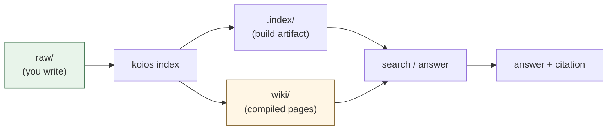
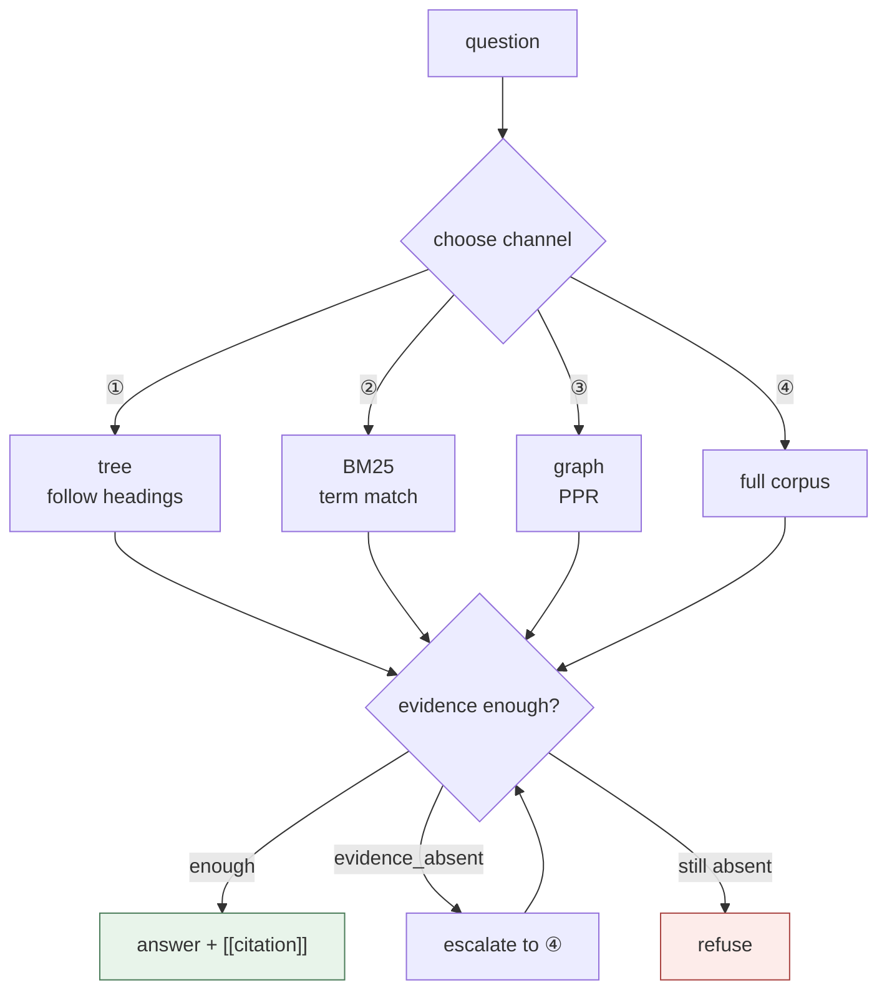
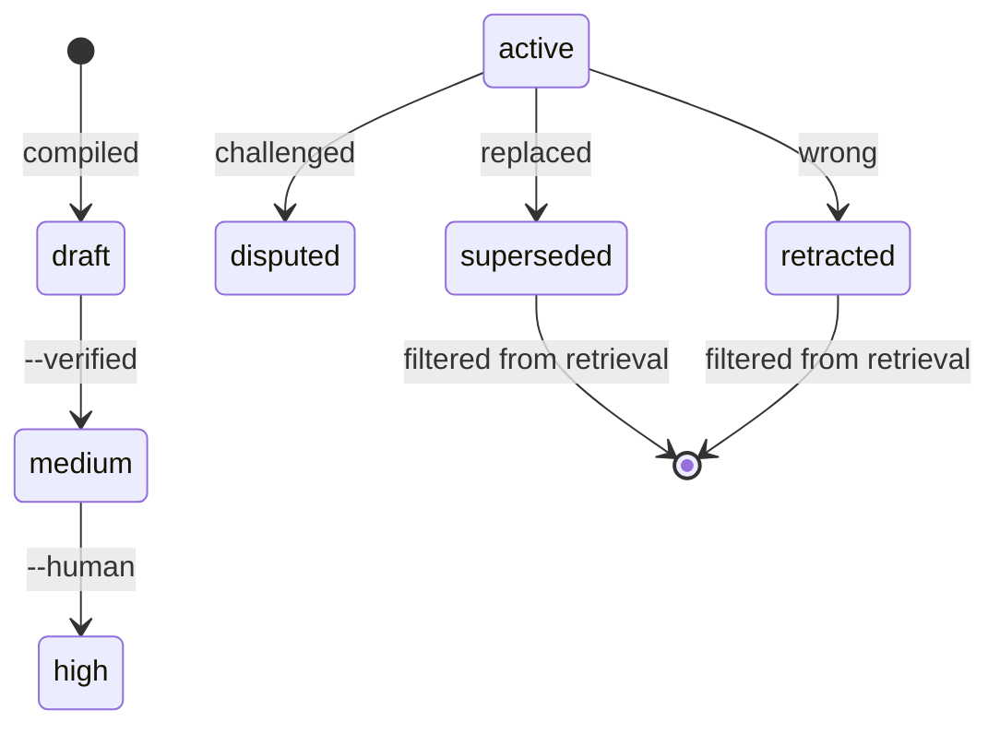

[](https://github.com/DeepTrial/KoiosBase/actions/workflows/ci.yml)
[](https://github.com/DeepTrial/KoiosBase/releases)
[](../../LICENSE)

[中文](../../README.md) | [English](README.en.md) | [Français](README.fr.md) | [Español](README.es.md) | [日本語](README.ja.md) | [한국어](README.ko.md)

# KoiosBase

A Markdown-native knowledge base for LLMs. You write Markdown, KoiosBase indexes
it, and every answer points back at the block it came from.

```console
$ koios search "revenue" -p myvault
[0] report.md#Financials/Revenue/1
    2024 Annual Report > Financials > Revenue
    ACME Corp revenue in 2024 was 3.2 billion yuan, up 12 percent.
[1] sources/report.md#2024 Annual Report/覆盖章节/1
    2024 Annual Report > 2024 Annual Report > 覆盖章节
    - Financials (`report.md#Financials`) - Revenue (`report.md#Financials/Revenue`) - Cash Flow (`report.md#Finan
[2] sources/report.md#2024 Annual Report/本文档能回答的问题/1
    2024 Annual Report > 2024 Annual Report > 本文档能回答的问题
    - 关于「Financials」，本文档有哪些说明？ (report.md#Financials) - 关于「Revenue」，本文档有哪些说明？ (report.md#Financials/Revenue) - 关于「
[3] sources/report.md#2024 Annual Report/导读摘要/1
    2024 Annual Report > 2024 Annual Report > 导读摘要
    ACME Corp revenue in 2024 was 3. 2 billion yuan, up 12 percent. Operating cash flow was positive for the year.
```

- **Markdown is the truth.** The index is a build artifact — delete it and it
  rebuilds byte-for-byte.
- **Knowledge has a lifecycle.** Retract a block and every page citing it is
  marked stale and stops answering.



## Install

A single Rust binary with **no runtime dependencies**.

```bash
curl -LO https://github.com/DeepTrial/KoiosBase/releases/latest/download/koios-linux-x86_64
chmod +x koios-linux-x86_64
# or build from source (MuPDF's bindgen needs libclang)
git clone https://github.com/DeepTrial/KoiosBase && cd KoiosBase
cargo build --release --manifest-path rust-cli/Cargo.toml
```

```console
$ koios init demo && koios index demo && koios lint demo
initialized KoiosBase vault at demo
indexed 0 blocks from demo
---- lint: 0 finding(s)
```

### Connect an LLM (optional)

It works without one: the built-in generator returns only cited retrieved blocks
and never fabricates. To add a model, run `koios config --init -p myvault` and
fill in `koios.toml`:

```toml
[model]
base_url = "https://api.openai.com/v1"
model = "gpt-4o-mini"
api_key_env = "OPENAI_API_KEY"     # the NAME of the env var, never the key
```

Any endpoint speaking the OpenAI protocol works (`kind = "openai"`, the default):
OpenAI, Ollama, vLLM, DeepSeek, Moonshot, LiteLLM — and gateways proxying Claude,
which present that shape regardless of the model behind them. Only Anthropic's own
endpoint needs `kind = "anthropic"`.

The guardrails apply to your model too — missing citations are reported rather
than silently accepted, and a failing model is an error rather than a fabricated
answer:

```console
$ koios query "revenue" -p myvault --llm-cmd 'printf "%s" "Revenue was 3.2 billion yuan."'
verdict: enough  hits: 3  escalated: false
Revenue was 3.2 billion yuan.
[contracts] citation=0/1 sentences cited
```

## Usage

```console
$ koios init myvault                            # create a vault
$ koios index myvault                           # after every raw/ edit
$ koios search "revenue" -p myvault             # search
$ koios query  "revenue" -p myvault             # full pipeline + verdict
verdict: enough  hits: 4  escalated: false
[0] report.md#Financials/Revenue/1
    ACME Corp revenue in 2024 was 3.2 billion yuan, up 12 percent.
[1] sources/report.md#2024 Annual Report/覆盖章节/1
    - Financials (`report.md#Financials`)
- Revenue (`report.md#Financials/Revenue`)
- Cash Flow (`report.md#Finan
[2] sources/report.md#2024 Annual Report/本文档能回答的问题/1
    - 关于「Financials」，本文档有哪些说明？ (report.md#Financials)
- 关于「Revenue」，本文档有哪些说明？ (report.md#Financials/Revenue)
- 关于「
[3] sources/report.md#2024 Annual Report/导读摘要/1
    ACME Corp revenue in 2024 was 3. 2 billion yuan, up 12 percent. Operating cash flow was positive for the year.
$ koios compile -p myvault                      # compile structured pages
compiled: entities=2 entity_pages=2 source_pages=1 affected_pages=5 stamp=2026-10-10
$ koios studio brief -p myvault -t revenue      # export
wrote myvault/wiki/synthesis/brief-revenue.md
$ koios mcp --install codex                     # register with an MCP host
```

Retrieval picks a channel per question and asks whether the evidence suffices
before answering:



**ACL**: `--groups finance-team` sets your principal; without it you are
anonymous and restricted documents are invisible — by design.

**Vault layout**: `raw/` (you write), `wiki/` (generated, commit it),
`.index/` (build artifact, never commit).

## Maintenance

| Task | Command |
| --- | --- |
| After editing `raw/` | `koios index myvault` |
| Health check | `koios lint myvault` |
| After upgrading | `koios index myvault --full` |
| A fact is wrong | `koios retract -p myvault -b "block-id" --reason "..."` |
| Raise confidence | `koios promote --human-confirmed "wiki/entities/acme.md"` |

```console
$ koios retract -p myvault -b "report.md#Financials/Revenue/1" --reason "wrong figure"
retracted report.md#Financials/Revenue/1; affected pages: 3 ["entities/acme-corp.md", "entities/acme.md", "synthesis/brief-revenue.md"]
```



Confidence rises only on evidence from outside the generator (§5.4 — never
citation counts): `draft → medium → high`.

## Docs

- `docs/KoiosBase设计文档v1.3.md` — design baseline
- `docs/python-rust-parity.md` — the port's audit trail
- `docs/known-gaps.md` — known gaps and limitations
- `docs/i18n.md` — translation convention
- `AGENTS.md` — the contract written into every vault

MIT — see [LICENSE](../../LICENSE).
