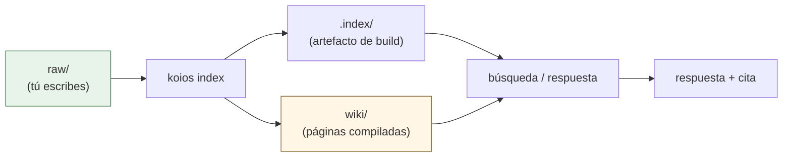
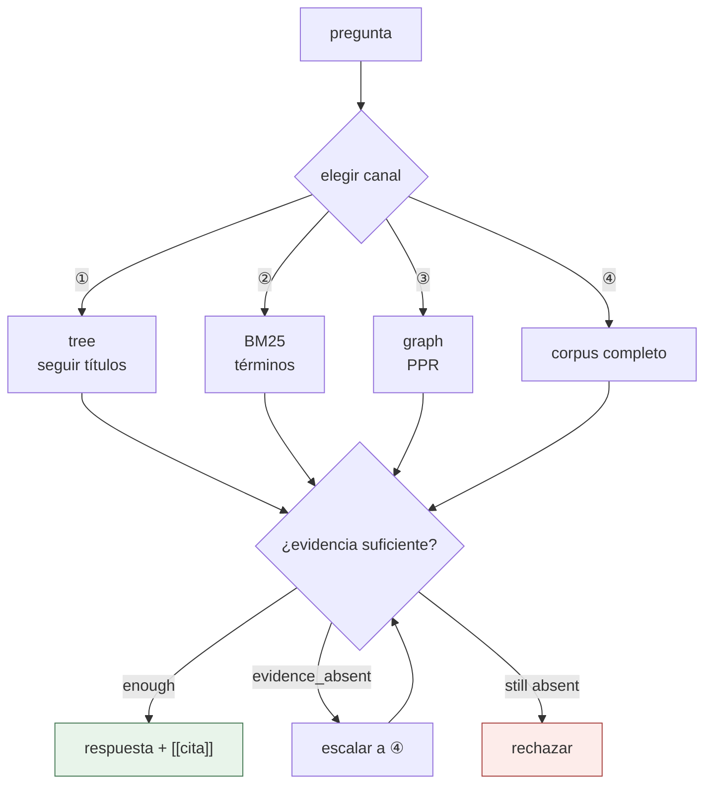
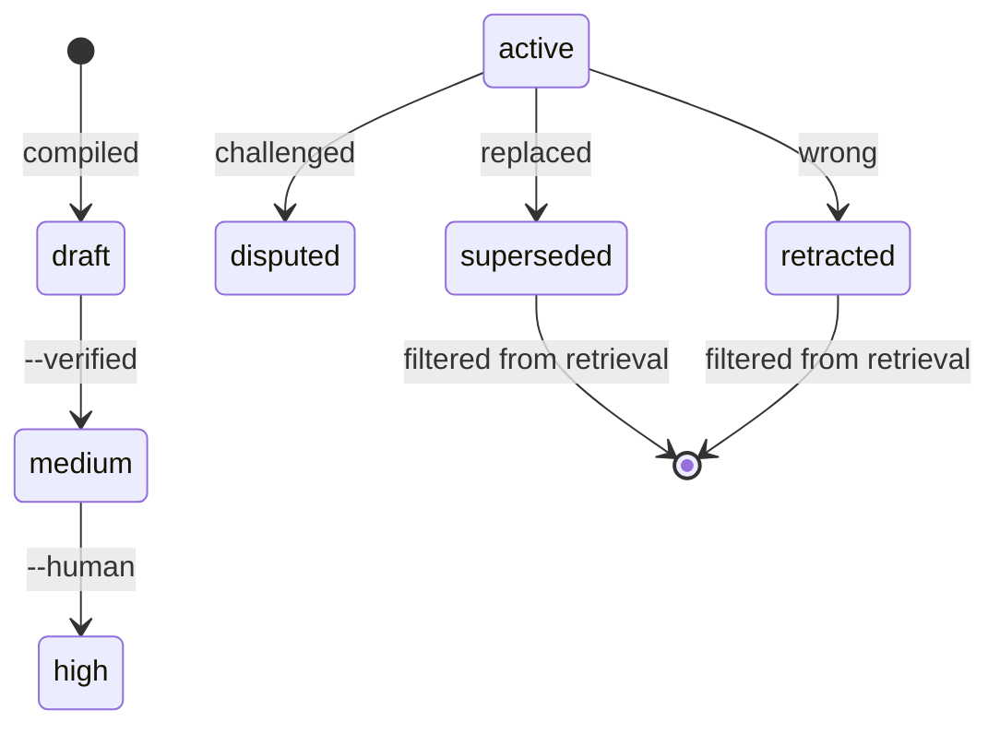

[](https://github.com/DeepTrial/KoiosBase/actions/workflows/ci.yml)
[](https://github.com/DeepTrial/KoiosBase/releases)
[](../../LICENSE)

[中文](../../README.md) | [English](README.en.md) | [Français](README.fr.md) | [Español](README.es.md) | [日本語](README.ja.md) | [한국어](README.ko.md)

# KoiosBase

Una base de conocimiento LLM nativa de Markdown. Tú escribes Markdown,
KoiosBase lo indexa y cada respuesta apunta al bloque del que proviene.

```console
$ koios search "revenue" -p myvault
[0] report.md#Financials/Revenue/1
    2024 Annual Report > Financials > Revenue
    ACME Corp revenue in 2024 was 3.2 billion yuan, up 12 percent.
[1] sources/report.md#2024 Annual Report/覆盖章节/1
    2024 Annual Report > 2024 Annual Report > 覆盖章节
    - Financials (`report.md#Financials`) - Revenue (`report.md#Financials/Revenue`) - Cash Flow (`report.md#Finan
[2] sources/report.md#2024 Annual Report/本文档能回答的问题/1
    2024 Annual Report > 2024 Annual Report > 本文档能回答的问题
    - 关于「Financials」，本文档有哪些说明？ (report.md#Financials) - 关于「Revenue」，本文档有哪些说明？ (report.md#Financials/Revenue) - 关于「
[3] sources/report.md#2024 Annual Report/导读摘要/1
    2024 Annual Report > 2024 Annual Report > 导读摘要
    ACME Corp revenue in 2024 was 3. 2 billion yuan, up 12 percent. Operating cash flow was positive for the year.
```

- **Markdown es la verdad.** El índice es un artefacto de compilación: bórralo y
  se reconstruye byte a byte.
- **El conocimiento tiene ciclo de vida.** Retrae un bloque y todas las páginas
  que lo citan se marcan como obsoletas y dejan de responder.



## Instalación

Un único binario de Rust, **sin dependencias en tiempo de ejecución**.

```bash
curl -LO https://github.com/DeepTrial/KoiosBase/releases/latest/download/koios-linux-x86_64
chmod +x koios-linux-x86_64
# o compilar desde el código fuente (el bindgen de MuPDF necesita libclang)
git clone https://github.com/DeepTrial/KoiosBase && cd KoiosBase
cargo build --release --manifest-path rust-cli/Cargo.toml
```

```console
$ koios init demo && koios index demo && koios lint demo
initialized KoiosBase vault at demo
indexed 0 blocks from demo
---- lint: 0 finding(s)
```

### Conectar un LLM (opcional)

Funciona sin modelo: el generador integrado solo devuelve bloques recuperados y
citados, nunca inventa. Para añadir un modelo, ejecuta
`koios config --init -p myvault` y rellena `koios.toml`:

```toml
[model]
base_url = "https://api.openai.com/v1"
model = "gpt-4o-mini"
api_key_env = "OPENAI_API_KEY"     # el NOMBRE de la variable de entorno, nunca la clave
```

Las barreras de seguridad también se aplican a tu modelo: las citas faltantes se
reportan en lugar de aceptarse en silencio, y un modelo que falla es un error y
no una respuesta fabricada:

```console
$ koios query "revenue" -p myvault --llm-cmd 'printf "%s" "Revenue was 3.2 billion yuan."'
verdict: enough  hits: 3  escalated: false
Revenue was 3.2 billion yuan.
[contracts] citation=0/1 sentences cited
```

## Uso

```console
$ koios init myvault                            # crear un vault
$ koios index myvault                           # tras cada edición de raw/
$ koios search "revenue" -p myvault             # buscar
$ koios query  "revenue" -p myvault             # pipeline completo + verdict
verdict: enough  hits: 4  escalated: false
[0] report.md#Financials/Revenue/1
    ACME Corp revenue in 2024 was 3.2 billion yuan, up 12 percent.
[1] sources/report.md#2024 Annual Report/覆盖章节/1
    - Financials (`report.md#Financials`)
- Revenue (`report.md#Financials/Revenue`)
- Cash Flow (`report.md#Finan
[2] sources/report.md#2024 Annual Report/本文档能回答的问题/1
    - 关于「Financials」，本文档有哪些说明？ (report.md#Financials)
- 关于「Revenue」，本文档有哪些说明？ (report.md#Financials/Revenue)
- 关于「
[3] sources/report.md#2024 Annual Report/导读摘要/1
    ACME Corp revenue in 2024 was 3. 2 billion yuan, up 12 percent. Operating cash flow was positive for the year.
$ koios compile -p myvault                      # compilar páginas estructuradas
compiled: entities=2 entity_pages=2 source_pages=1 affected_pages=5 stamp=2026-10-10
$ koios studio brief -p myvault -t revenue      # exportar
wrote myvault/wiki/synthesis/brief-revenue.md
$ koios mcp --install codex                     # registrar en un host MCP
```

La recuperación elige un canal por pregunta y comprueba si la evidencia basta
antes de responder:



**ACL**: `--groups finance-team` define tu principal; sin él eres anónimo y los
documentos restringidos son invisibles — por diseño.

**Estructura del vault**: `raw/` (tú escribes), `wiki/` (generado, haz commit),
`.index/` (artefacto de build, nunca hagas commit).

## Mantenimiento

| Tarea | Comando |
| --- | --- |
| Tras editar `raw/` | `koios index myvault` |
| Chequeo de salud | `koios lint myvault` |
| Tras actualizar | `koios index myvault --full` |
| Un hecho es incorrecto | `koios retract -p myvault -b "block-id" --reason "..."` |
| Elevar la confianza | `koios promote --human-confirmed "wiki/entities/acme.md"` |

```console
$ koios retract -p myvault -b "report.md#Financials/Revenue/1" --reason "wrong figure"
retracted report.md#Financials/Revenue/1; affected pages: 3 ["entities/acme-corp.md", "entities/acme.md", "synthesis/brief-revenue.md"]
```



La confianza solo sube con evidencia externa al generador (§5.4 — nunca contando
citas): `draft → medium → high`.

## Documentación

- `docs/KoiosBase设计文档v1.3.md` — base de diseño
- `docs/python-rust-parity.md` — la traza de auditoría del port
- `docs/known-gaps.md` — lagunas conocidas y limitaciones
- `docs/i18n.md` — convención de traducción
- `AGENTS.md` — el contrato escrito en cada vault

MIT — véase [LICENSE](../../LICENSE).
