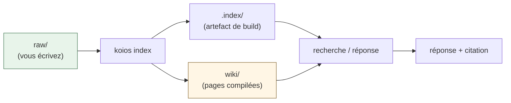
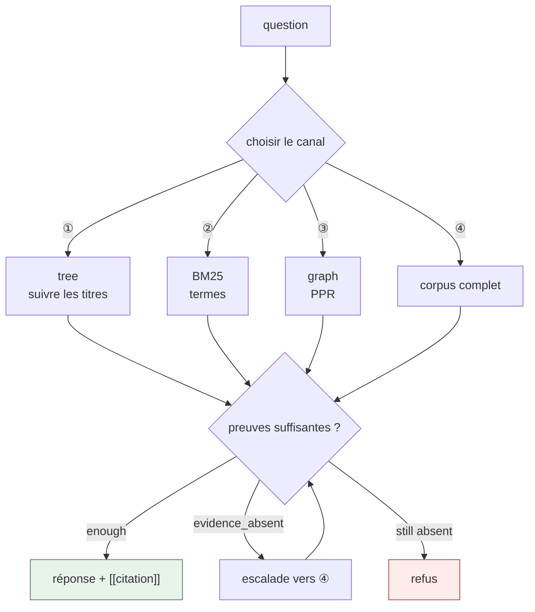
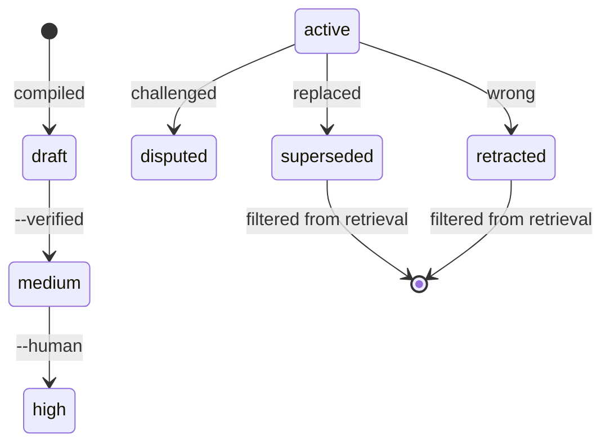

[](https://github.com/DeepTrial/KoiosBase/actions/workflows/ci.yml)
[](https://github.com/DeepTrial/KoiosBase/releases)
[](../../LICENSE)

[中文](../../README.md) | [English](README.en.md) | [Français](README.fr.md) | [Español](README.es.md) | [日本語](README.ja.md) | [한국어](README.ko.md)

# KoiosBase

Une base de connaissances LLM native Markdown. Vous écrivez du Markdown,
KoiosBase l'indexe, et chaque réponse renvoie au bloc dont elle provient.

```console
$ koios search "revenue" -p myvault
[0] report.md#Financials/Revenue/1
    2024 Annual Report > Financials > Revenue
    ACME Corp revenue in 2024 was 3.2 billion yuan, up 12 percent.
[1] sources/report.md#2024 Annual Report/覆盖章节/1
    2024 Annual Report > 2024 Annual Report > 覆盖章节
    - Financials (`report.md#Financials`) - Revenue (`report.md#Financials/Revenue`) - Cash Flow (`report.md#Finan
[2] sources/report.md#2024 Annual Report/本文档能回答的问题/1
    2024 Annual Report > 2024 Annual Report > 本文档能回答的问题
    - 关于「Financials」，本文档有哪些说明？ (report.md#Financials) - 关于「Revenue」，本文档有哪些说明？ (report.md#Financials/Revenue) - 关于「
[3] sources/report.md#2024 Annual Report/导读摘要/1
    2024 Annual Report > 2024 Annual Report > 导读摘要
    ACME Corp revenue in 2024 was 3. 2 billion yuan, up 12 percent. Operating cash flow was positive for the year.
```

- **Le Markdown est la vérité.** L'index est un artefact de build — supprimez-le
  et il se reconstruit octet pour octet.
- **La connaissance a un cycle de vie.** Rétractez un bloc et chaque page qui le
  cite est marquée obsolète et cesse de répondre.



## Installation

Un unique binaire Rust, **sans dépendance à l'exécution**.

```bash
curl -LO https://github.com/DeepTrial/KoiosBase/releases/latest/download/koios-linux-x86_64
chmod +x koios-linux-x86_64
# ou depuis les sources (le bindgen de MuPDF nécessite libclang)
git clone https://github.com/DeepTrial/KoiosBase && cd KoiosBase
cargo build --release --manifest-path rust-cli/Cargo.toml
```

```console
$ koios init demo && koios index demo && koios lint demo
initialized KoiosBase vault at demo
indexed 0 blocks from demo
---- lint: 0 finding(s)
```

### Brancher un LLM (optionnel)

Cela fonctionne sans modèle : le générateur intégré ne renvoie que des blocs
retrouvés et cités, il n'invente jamais. Pour ajouter un modèle, lancez
`koios config --init -p myvault` et remplissez `koios.toml` :

```toml
[model]
base_url = "https://api.openai.com/v1"
model = "gpt-4o-mini"
api_key_env = "OPENAI_API_KEY"     # le NOM de la variable d'environnement, jamais la clé
```

Les garde-fous s'appliquent aussi à votre modèle — les citations manquantes sont
signalées et non acceptées en silence, et un modèle en panne est une erreur
plutôt qu'une réponse fabriquée :

```console
$ koios query "revenue" -p myvault --llm-cmd 'printf "%s" "Revenue was 3.2 billion yuan."'
verdict: enough  hits: 3  escalated: false
Revenue was 3.2 billion yuan.
[contracts] citation=0/1 sentences cited
```

## Utilisation

```console
$ koios init myvault                            # créer un vault
$ koios index myvault                           # après chaque édition de raw/
$ koios search "revenue" -p myvault             # rechercher
$ koios query  "revenue" -p myvault             # pipeline complet + verdict
verdict: enough  hits: 4  escalated: false
[0] report.md#Financials/Revenue/1
    ACME Corp revenue in 2024 was 3.2 billion yuan, up 12 percent.
[1] sources/report.md#2024 Annual Report/覆盖章节/1
    - Financials (`report.md#Financials`)
- Revenue (`report.md#Financials/Revenue`)
- Cash Flow (`report.md#Finan
[2] sources/report.md#2024 Annual Report/本文档能回答的问题/1
    - 关于「Financials」，本文档有哪些说明？ (report.md#Financials)
- 关于「Revenue」，本文档有哪些说明？ (report.md#Financials/Revenue)
- 关于「
[3] sources/report.md#2024 Annual Report/导读摘要/1
    ACME Corp revenue in 2024 was 3. 2 billion yuan, up 12 percent. Operating cash flow was positive for the year.
$ koios compile -p myvault                      # compiler les pages structurées
compiled: entities=2 entity_pages=2 source_pages=1 affected_pages=5 stamp=2026-10-10
$ koios studio brief -p myvault -t revenue      # exporter
wrote myvault/wiki/synthesis/brief-revenue.md
$ koios mcp --install codex                     # enregistrer auprès d'un hôte MCP
```

La recherche choisit un canal par question et demande si les preuves suffisent
avant de répondre :



**ACL** : `--groups finance-team` définit votre principal ; sans cette option
vous êtes anonyme et les documents restreints sont invisibles — c'est voulu.

**Structure du vault** : `raw/` (vous écrivez), `wiki/` (généré, à commiter),
`.index/` (artefact de build, jamais à commiter).

## Maintenance

| Tâche | Commande |
| --- | --- |
| Après une édition de `raw/` | `koios index myvault` |
| Contrôle de santé | `koios lint myvault` |
| Après une montée de version | `koios index myvault --full` |
| Un fait est faux | `koios retract -p myvault -b "block-id" --reason "..."` |
| Élever la confiance | `koios promote --human-confirmed "wiki/entities/acme.md"` |

```console
$ koios retract -p myvault -b "report.md#Financials/Revenue/1" --reason "wrong figure"
retracted report.md#Financials/Revenue/1; affected pages: 3 ["entities/acme-corp.md", "entities/acme.md", "synthesis/brief-revenue.md"]
```



La confiance ne monte que sur des preuves extérieures au générateur (§5.4 —
jamais sur un compte de citations) : `draft → medium → high`.

## Lacunes connues

- **Le modèle n'écrit que les réponses.** L'extraction d'entités, le Grader et
  le juge L2 restent déterministes ; configurer un modèle ne les améliore pas.
- **Le juge L2 est une ébauche** : il ne tranche que les relations numériques et
  renvoie `unknown` pour tout le reste.
- **Les pages obsolètes ne sont pas recompilées automatiquement** — elles sont
  rétrogradées et signalées.
- **Le binaire Windows n'est vérifié que structurellement** (PE32+ valide, sans
  exécution sur un runner disponible).

```console
$ koios eval -p myvault
total=5 recall@1=0.600 refusal_acc=0.500 citation_cov=0.434 needs_llm=1
  SKIP [needs-llm] 公司是否披露了季度分红政策？ -> keyword evidence cannot decide this in v0.1 (2 blocks)
$ koios checkclaim "revenue 3.2bn" "revenue was 3.2 billion yuan"
entailed
```

## Documentation

- `docs/KoiosBase设计文档v1.3.md` — référence de conception
- `docs/python-rust-parity.md` — la piste d'audit du portage
- `docs/i18n.md` — convention de traduction
- `AGENTS.md` — le contrat écrit dans chaque vault

MIT — voir [LICENSE](../../LICENSE).
