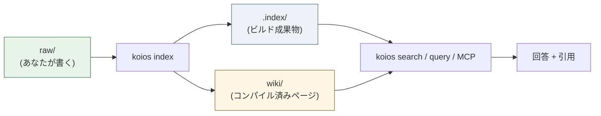
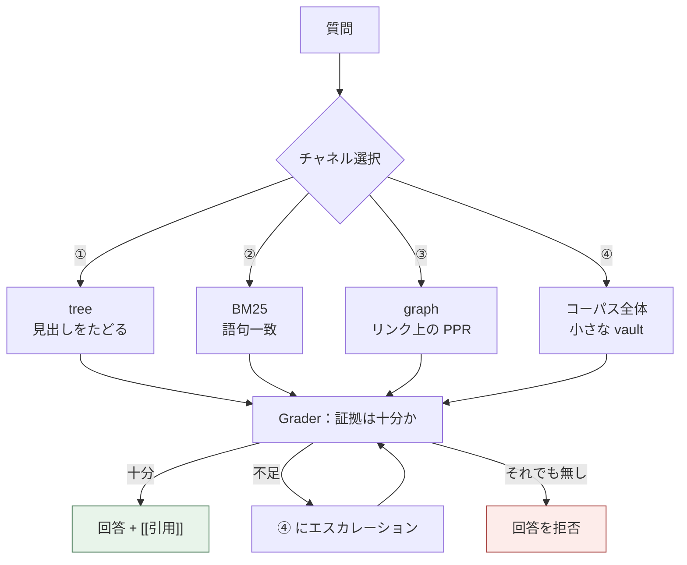
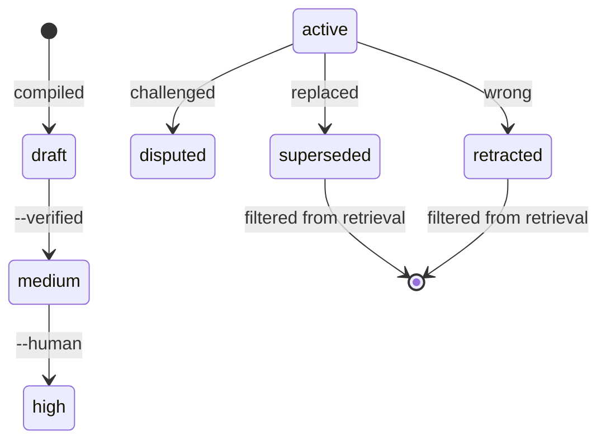
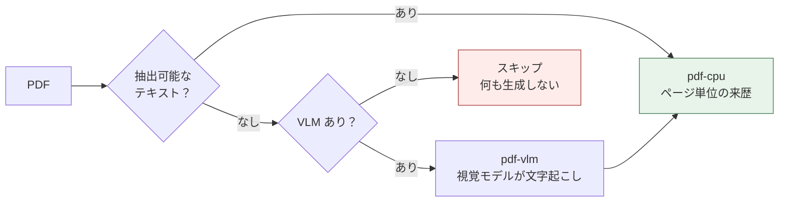

[](https://github.com/DeepTrial/KoiosBase/actions/workflows/ci.yml)
[](https://github.com/DeepTrial/KoiosBase/releases)
[](../../LICENSE)

[English](../../README.md) | [中文](README.zh.md) | [日本語](README.ja.md)

# KoiosBase

Markdown ネイティブな LLM ナレッジベースです。Markdown を書けば KoiosBase が
インデックスし、返ってくる答えは必ずその出所のブロックを指し示します。

```console
$ koios search "revenue" -p myvault
[0] report.md#Financials/Revenue/1
    2024 Annual Report > Financials > Revenue
    ACME Corp revenue in 2024 was 3.2 billion yuan, up 12 percent.
[1] sources/report.md#2024 Annual Report/覆盖章节/1
    2024 Annual Report > 2024 Annual Report > 覆盖章节
    - Financials (`report.md#Financials`) - Revenue (`report.md#Financials/Revenue`) - Cash Flow (`report.md#Finan
[2] sources/report.md#2024 Annual Report/本文档能回答的问题/1
    2024 Annual Report > 2024 Annual Report > 本文档能回答的问题
    - 关于「Financials」，本文档有哪些说明？ (report.md#Financials) - 关于「Revenue」，本文档有哪些说明？ (report.md#Financials/Revenue) - 关于「
[3] sources/report.md#2024 Annual Report/导读摘要/1
    2024 Annual Report > 2024 Annual Report > 导读摘要
    ACME Corp revenue in 2024 was 3. 2 billion yuan, up 12 percent. Operating cash flow was positive for the year.
```

「チャンク分割 + 埋め込み + top-k」と異なるのは次の 2 点です。

- **Markdown が真実です。** インデックスはビルド成果物です。削除しても
  `koios index` がバイト単位で再構築します。重要なものはデータベースの中だけに
  存在しません。
- **知識にはライフサイクルがあります。** ブロックを `retracted` にすると伝播
  します。それを引用するページはすべて stale とマークされ、回答に使われなく
  なります。



---

## インストール

単一の Rust バイナリで、**実行時依存がありません** —— SQLite は同梱されています。

```bash
# 方法 A — ビルド済みバイナリ
curl -LO https://github.com/DeepTrial/KoiosBase/releases/latest/download/koios-linux-x86_64
chmod +x koios-linux-x86_64

# 方法 B — ソースからビルド（MuPDF の bindgen に libclang が必要）
git clone https://github.com/DeepTrial/KoiosBase && cd KoiosBase
cargo build --release --manifest-path rust-cli/Cargo.toml
```

```console
$ koios init demo && koios index demo && koios lint demo
initialized KoiosBase vault at demo
indexed 0 blocks from demo
---- lint: 0 finding(s)
```

---

## 使い方

**1. vault を作る** — `koios init myvault`

```text
myvault/
  raw/          あなたのドキュメント    <- これを管理する
  wiki/         コンパイル済みページ    <- 生成物、手で編集しない
  .index/       ビルド成果物            <- 決してコミットしない
  koios.toml    任意のモデル設定
```

**2. ドキュメントを追加** します（`myvault/raw/` に）。frontmatter は任意ですが、
信頼メタデータはそこに書きます。

```markdown
---
title: 2024 Annual Report
acl: [finance-team]     # 任意：グループに限定
ttl: 365d               # 任意：鮮度の期間
---

# Financials

## Revenue

ACME Corp revenue in 2024 was 3.2 billion yuan, up 12 percent.
```

**3. インデックスを作ります** —— 編集のたびに実行します。インクリメンタルで
冪等なので、気軽に実行してかまいません。

```bash
koios index myvault
```



**4. 検索と質問：**

```bash
koios search "revenue" -p myvault                    # BM25 + graph、上位 8 件
koios search "revenue" -p myvault -k 20              # より多くの結果
koios search "revenue" -p myvault -c tree            # チャネル ① を強制
koios search "revenue" -p myvault --groups finance-team
koios query  "revenue" -p myvault                    # 完全なパイプライン + verdict
```

`-c` は `hybrid`（既定）、`tree`、`full`、`graph` を受け付けます。`--groups` は
ACL の主体を指定します。指定しない場合は匿名となり、制限付きドキュメントは
見えなくなります —— バグではなく仕様です。

```console
$ koios query "revenue" -p myvault
verdict: enough  hits: 4  escalated: false
[0] report.md#Financials/Revenue/1
    ACME Corp revenue in 2024 was 3.2 billion yuan, up 12 percent.
[1] sources/report.md#2024 Annual Report/覆盖章节/1
    - Financials (`report.md#Financials`)
- Revenue (`report.md#Financials/Revenue`)
- Cash Flow (`report.md#Finan
[2] sources/report.md#2024 Annual Report/本文档能回答的问题/1
    - 关于「Financials」，本文档有哪些说明？ (report.md#Financials)
- 关于「Revenue」，本文档有哪些说明？ (report.md#Financials/Revenue)
- 关于「
[3] sources/report.md#2024 Annual Report/导读摘要/1
    ACME Corp revenue in 2024 was 3. 2 billion yuan, up 12 percent. Operating cash flow was positive for the year.
```

**5. コンパイル** して構造化ページを生成します：

```console
$ koios compile -p myvault
compiled: entities=2 entity_pages=2 source_pages=1 affected_pages=5 stamp=2026-10-10
```

エンティティを `wiki/entities/` に、ドキュメントごとの読み手ガイドを
`wiki/sources/` に書き出します。**再コンパイルしても、ページの昇格済み
confidence と人が書いたノートは保持されます。**

**6. エクスポート** —— ディスク上のファイルになるため、こちらも ACL に従います：

```console
$ koios studio brief   -p myvault -t revenue
wrote myvault/wiki/synthesis/brief-revenue.md
$ koios studio mindmap -p myvault -t Financials
wrote myvault/wiki/synthesis/mindmap-financials.md
```

**7. MCP でエージェントに提供** —— `koios mcp` は stdio 経由で JSON-RPC 2.0 を
話し、`koios_search`、`koios_ask`、`koios_write_answer` を公開します。手で JSON
を書くより、登録コマンドを使ってください：

```bash
koios mcp --install            # PATH 上で見つかったすべてのホスト
koios mcp --install codex      # または 1 つ指定
```

これにより `SKILL.md` もインストールされます。そこにはモデルが守るべき唯一の
重要な規則が書かれています。**引用のない回答は vault に存在しないという意味
であり、自分の知識でその穴を埋めてはならない。**

---

## LLM を接続する

既定では、KoiosBase は取得したブロックだけから回答します。組み込みジェネレータは
引用付きで上位ブロックを返し、決して作り話をしません。既定の挙動は設定なしでも
信頼できるものでなければならないからです。

```bash
koios config --init -p myvault && $EDITOR myvault/koios.toml
```

```toml
[model]
base_url = "https://api.openai.com/v1"
model = "gpt-4o-mini"
api_key_env = "OPENAI_API_KEY"     # 環境変数の「名前」であって、キー自体ではない
```

**ガードレールはあなたのモデルにも適用されます** —— モデルを渡しても、作り話が
許されるわけではありません。引用漏れは黙って受け入れられるのではなく報告されます
（以下は後述の `retract` を実行した後の同じ vault なので `hits: 3` です）：

```console
$ koios query "revenue" -p myvault --llm-cmd 'printf "%s" "Revenue was 3.2 billion yuan."'
verdict: enough  hits: 3  escalated: false
Revenue was 3.2 billion yuan.
[contracts] citation=0/1 sentences cited
```

モデルが失敗するのはエラーであって、捏造された回答ではありません：

```console
$ koios query "revenue" -p myvault     # api_key_env が未設定の変数を指す
verdict: enough  hits: 3  escalated: false
model config names api_key_env = "OPENAI_API_KEY" but that variable is not set
```

検索が権威であり続けます。制限付きドキュメントはモデルが何を見るより**前**に
取り除かれているため、モデルは与えられていないものを漏らしようがありません。

### ライブラリとして使う

```rust
use koios::pipeline::full_query_with;
use koios::connect;

let conn = connect(std::path::Path::new("myvault")).unwrap();
let my_llm = |question: &str, context: &str| -> Result<String, String> {
    Ok(call_your_model(context))     // OpenAI、Anthropic、ローカル、何でも
};
let result = full_query_with(&conn, "revenue", 8,
                             Some(&["finance-team".into()]), Some(&my_llm));
println!("{}", result.answer);
println!("{:?}", result.violations);   // 契約が守られていれば空
```

呼び出し可能オブジェクトの契約は `Fn(&str, &str) -> Result<String, String>`
（別名 `koios::pipeline::LlmFn`）です。コードベースにはプロバイダ向けアダプタも
API キー処理も存在しません —— ベンダーは組み込まれていません。

---

## 保守

| タスク | コマンド |
| --- | --- |
| `raw/` を編集した後 | `koios index myvault` |
| 健全性チェック | `koios lint myvault` |
| アップグレード後 | `koios index myvault --full` |

`koios lint` は壊れた wikilink、出所のない主張、期限切れ TTL、stale ページ、
孤立ページを報告します。プログラム的（L1）で、モデルを使わないため CI で
回せるほど軽いです。

### 誤りを正す

編集で回避するのではなく、retract してください：

```console
$ koios retract -p myvault -b "report.md#Financials/Revenue/1" --reason "wrong figure"
retracted report.md#Financials/Revenue/1; affected pages: 3 ["entities/acme-corp.md", "entities/acme.md", "synthesis/brief-revenue.md"]
```

そのブロックは回答に使われなくなり、それを引用するページは stale とマークされ、
理由が記録されます。**制限付き**ブロックを retract するには、自分が持っている
権限を `--groups` で指定する必要があります。



### コンパイル済みページを昇格させる

ページは `confidence: draft` から始まります。昇格には、ジェネレータ自身が
作っていない証拠が必要です（§5.4 —— 引用の数では決してありません）：

```bash
cd myvault                                    # promote はファイルシステムのパスを取る
koios promote --verified        "wiki/entities/acme.md"   # -> medium
koios promote --human-confirmed "wiki/entities/acme.md"   # -> high
```

`draft → medium → high`。

### 日々の手入れ

- **`.index/` は決してコミットしない** —— 派生物です。**`wiki/` はコミットする**
  —— バージョン管理された Markdown です。
- **`raw/` をバックアップする** —— そこだけが唯一かけがえのないディレクトリです。

---

## マルチモーダル（視覚）モデル

PDF は 2 段階で解析されます。常に利用できる CPU テキスト層と、ページが
スキャンされたものに見えるときだけ働く **VLM 層** です。



`koios.toml` に 1 ブロック追加するだけで有効になります：

```toml
[model.vision]
model = "gpt-4o"
```

これがない場合、スキャンされたページは何も生成しません —— 黙って、ですが
仕様です。誰も読んでいないページのテキストを捏造する方が、インデックスしない
より悪いからです。ライブラリとして使う場合、呼び出し可能オブジェクトが受け取る
のはパスではなく **PNG のバイト列** です：

```rust
use koios::pdf::extract_pages;

let my_vlm = |_path: &str, png: &[u8]| -> Result<String, String> {
    Ok(vision_model_transcribe(png))
};
let pages = extract_pages(std::path::Path::new("scan.pdf"), Some(&my_vlm));
```

PDF を超えるマルチモーダル入力（画像やグラフを第一級のソースにする）は未実装
です。KoiosBase は Markdown ネイティブであり、視覚はテキスト抽出が失敗した
ときの復旧経路としてだけ入ってきます。

---

## 概念

| 用語 | 意味 |
| --- | --- |
| **vault** | ルートディレクトリ：`raw/` + `wiki/` + `.index/` |
| **block** | 引用可能な 1 段落。アドレスは `doc.md#Section/1` |
| **layer** | `raw`（人が書いた）対 `wiki`（コンパイル済み） |
| **channel** | 検索戦略：① tree、② BM25、③ graph、④ corpus |
| **state** | `active / superseded / disputed / retracted / draft` |
| **stale** | ソースが変わったコンパイル済みページ。利用可能だが印が付く |

7 つの原則がすべての仕組みを縛っています：

- **P1** Markdown が唯一の情報源である。
- **P2** 最も細かい粒度で保存し、任意の粒度で取得する。
- **P3** 検索はナビゲーションと推論であり、類似度競争ではない。
- **P4** 知識は取り込み時に合成され、クエリごとに再計算されない。
- **P5** 知識は状態を持ち、誤りは伝播し、修復可能である。
- **P6** すべての主張はその出所まで追跡可能である。
- **P7** 判定者は生成者と出自が異ならなければならない。

---

## 既知のギャップ

見落としではなく、記録された限界です。このシステムに依存する前に読んでください。

- **モデルが書くのは回答だけです。** エンティティ抽出、ページ描画、Grader、
  L2 判定はすべて決定的なままです —— モデルを設定してもそれらは向上しません。
- **`needs_llm` のケース。** `koios eval` は「キーワードは当たるが本当の回答が
  存在しない」質問を報告します。v0.3 の cross-family Grader が必要です。
- **L2 判定はプレースホルダです。** プログラム的な関係（数値）だけを判定し、
  それ以外はすべて `unknown` を返します。
- **stale 時の非同期再コンパイルは未実装です。** stale ページは開示され降格
  されますが、再コンパイルは自動では走りません。
- **コンパイルの書き込み集合は O(corpus) です。** 正しさは解決済みで、書き込み
  範囲を狭めることは記録済みの負債です。
- **Windows バイナリは構造的にのみ検証されています。** 正しい PE32+ ですが、
  実行検証に使える Windows runner も Wine もありませんでした。

`tests/channels_eval.rs` が使うフィクスチャでの実際の出力：

```console
$ koios eval -p myvault
total=5 recall@1=0.600 refusal_acc=0.500 citation_cov=0.434 needs_llm=1
  SKIP [needs-llm] 公司是否披露了季度分红政策？ -> keyword evidence cannot decide this in v0.1 (2 blocks)
$ koios checkclaim "revenue 3.2bn" "revenue was 3.2 billion yuan"
entailed
```

---

## 構成

```text
KoiosBase/
  rust-cli/
    src/
      lib.rs        ブロックモデル、パーサ、インデクサ、connect()
      ingest.rs     raw + wiki -> 派生インデックス
      pdf.rs        MuPDF アダプタ（CPU + VLM の 2 層）
      retrieval.rs  BM25、RRF 融合、パーソナライズ PageRank
      pipeline.rs   検索 -> 組み立て -> 生成、契約
      compile.rs    エンティティ/ソース ページ、品質ゲート、合成
      state.rs      知識状態マシンとカスケード
      lint.rs       L1 の庭師
      acl.rs        ACL / マルチテナント
      mcp.rs        stdio 上の JSON-RPC
      studio.rs     brief / mindmap のエクスポート
      main.rs       コマンドラインインタフェース
    tests/          20 の統合テストスイート（146 テスト）
  docs/             設計ベースライン、i18n 構成、parity 監査
  docs/i18n/        本 README の中国語版と日本語版
```

## ドキュメント

- `docs/KoiosBase设计文档v1.3.md` —— 設計ベースライン（中国語）
- `docs/python-rust-parity.md` —— 移植作業の監査証跡
- `docs/i18n.md` —— 翻訳の構成
- `AGENTS.md` —— すべての vault に書き込まれる契約

## ライセンス

MIT —— [LICENSE](../../LICENSE) を参照してください。
