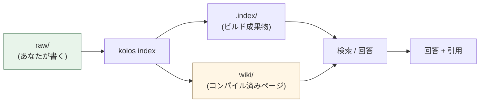
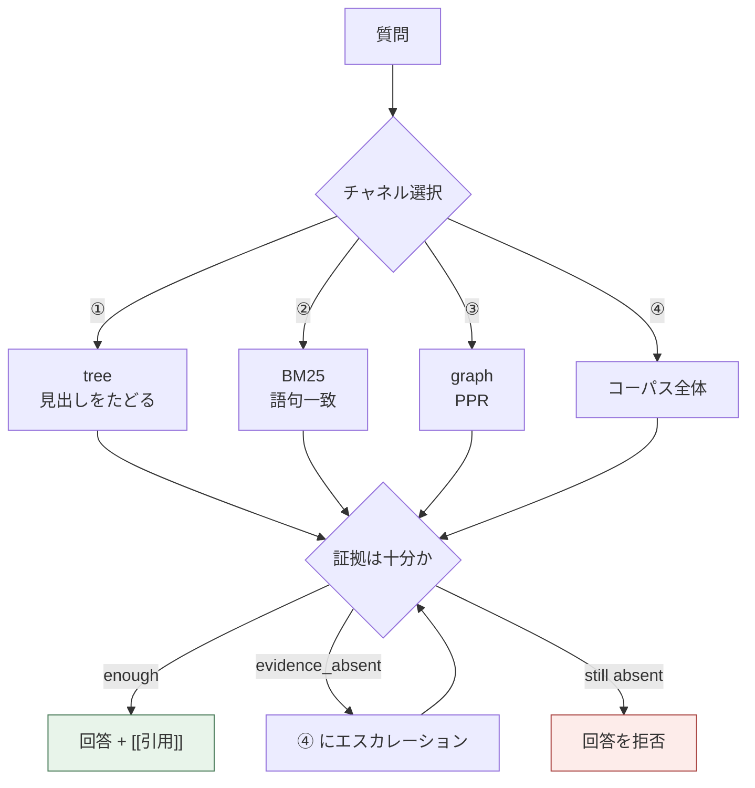
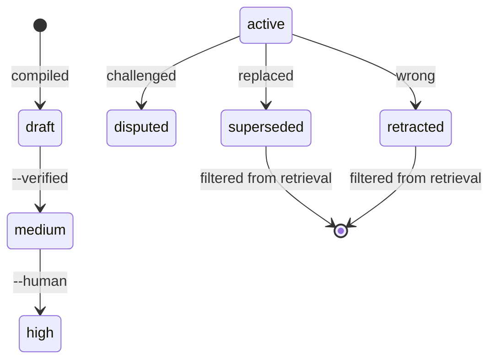

[](https://github.com/DeepTrial/KoiosBase/actions/workflows/ci.yml)
[](https://github.com/DeepTrial/KoiosBase/releases)
[](../../LICENSE)

[中文](../../README.md) | [English](README.en.md) | [Français](README.fr.md) | [Español](README.es.md) | [日本語](README.ja.md) | [한국어](README.ko.md)

# KoiosBase

Markdown ネイティブな LLM ナレッジベースです。Markdown を書けば KoiosBase が
インデックスし、答えは必ずその出所のブロックを指し示します。

```console
$ koios search "revenue" -p myvault
[0] report.md#Financials/Revenue/1
    2024 Annual Report > Financials > Revenue
    ACME Corp revenue in 2024 was 3.2 billion yuan, up 12 percent.
[1] sources/report.md#2024 Annual Report/覆盖章节/1
    2024 Annual Report > 2024 Annual Report > 覆盖章节
    - Financials (`report.md#Financials`) - Revenue (`report.md#Financials/Revenue`) - Cash Flow (`report.md#Finan
[2] sources/report.md#2024 Annual Report/本文档能回答的问题/1
    2024 Annual Report > 2024 Annual Report > 本文档能回答的问题
    - 关于「Financials」，本文档有哪些说明？ (report.md#Financials) - 关于「Revenue」，本文档有哪些说明？ (report.md#Financials/Revenue) - 关于「
[3] sources/report.md#2024 Annual Report/导读摘要/1
    2024 Annual Report > 2024 Annual Report > 导读摘要
    ACME Corp revenue in 2024 was 3. 2 billion yuan, up 12 percent. Operating cash flow was positive for the year.
```

- **Markdown が真実です。** インデックスはビルド成果物で、削除しても
  バイト単位で再構築されます。
- **知識にはライフサイクルがあります。** ブロックを retract すると、それを引用する
  ページは stale とマークされ、回答に使われなくなります。



## インストール

単一の Rust バイナリで、**実行時依存がありません**。

```bash
curl -LO https://github.com/DeepTrial/KoiosBase/releases/latest/download/koios-linux-x86_64
chmod +x koios-linux-x86_64
# またはソースからビルド（MuPDF の bindgen に libclang が必要）
git clone https://github.com/DeepTrial/KoiosBase && cd KoiosBase
cargo build --release --manifest-path rust-cli/Cargo.toml
```

```console
$ koios init demo && koios index demo && koios lint demo
initialized KoiosBase vault at demo
indexed 0 blocks from demo
---- lint: 0 finding(s)
```

### LLM を接続する（任意）

設定なしでも動作します。組み込みジェネレータは引用付きの取得ブロックだけを返し、
決して作り話をしません。モデルを追加するには `koios config --init -p myvault`
を実行して `koios.toml` を記入します：

```toml
[model]
base_url = "https://api.openai.com/v1"
model = "gpt-4o-mini"
api_key_env = "OPENAI_API_KEY"     # 環境変数の「名前」であって、キー自体ではない
```

OpenAI プロトコルを話すエンドポイントなら何でも使えます（`kind = "openai"`、既定値）：OpenAI、Ollama、vLLM、DeepSeek、Moonshot、LiteLLM —— および Claude をプロキシするゲートウェイ（背後のモデルに関係なくこの形式を提示します）。Anthropic 自身のエンドポイントのみ `kind = "anthropic"` が必要です。

ガードレールはあなたのモデルにも適用されます —— 引用漏れは黙認されず報告され、
モデルの失敗は捏造された回答ではなくエラーになります：

```console
$ koios query "revenue" -p myvault --llm-cmd 'printf "%s" "Revenue was 3.2 billion yuan."'
verdict: enough  hits: 3  escalated: false
Revenue was 3.2 billion yuan.
[contracts] citation=0/1 sentences cited
```

## 使い方

```console
$ koios init myvault                            # vault を作る
$ koios index myvault                           # raw/ を編集するたびに
$ koios search "revenue" -p myvault             # 検索
$ koios query  "revenue" -p myvault             # 完全なパイプライン + verdict
verdict: enough  hits: 4  escalated: false
[0] report.md#Financials/Revenue/1
    ACME Corp revenue in 2024 was 3.2 billion yuan, up 12 percent.
[1] sources/report.md#2024 Annual Report/覆盖章节/1
    - Financials (`report.md#Financials`)
- Revenue (`report.md#Financials/Revenue`)
- Cash Flow (`report.md#Finan
[2] sources/report.md#2024 Annual Report/本文档能回答的问题/1
    - 关于「Financials」，本文档有哪些说明？ (report.md#Financials)
- 关于「Revenue」，本文档有哪些说明？ (report.md#Financials/Revenue)
- 关于「
[3] sources/report.md#2024 Annual Report/导读摘要/1
    ACME Corp revenue in 2024 was 3. 2 billion yuan, up 12 percent. Operating cash flow was positive for the year.
$ koios compile -p myvault                      # 構造化ページを生成
compiled: entities=2 entity_pages=2 source_pages=1 affected_pages=5 stamp=2026-10-10
$ koios studio brief -p myvault -t revenue      # エクスポート
wrote myvault/wiki/synthesis/brief-revenue.md
$ koios mcp --install codex                     # MCP ホストに登録
```

検索は質問ごとにチャネルを選び、答える前に証拠が十分かを問いかけます：



**ACL**: `--groups finance-team` は主体を指定します。指定しない場合は匿名となり、
制限付きドキュメントは見えなくなります —— 仕様です。

**vault の構成**: `raw/`（あなたが書く）、`wiki/`（生成物、コミットする）、
`.index/`（ビルド成果物、決してコミットしない）。

## 保守

| タスク | コマンド |
| --- | --- |
| `raw/` を編集した後 | `koios index myvault` |
| 健全性チェック | `koios lint myvault` |
| アップグレード後 | `koios index myvault --full` |
| 事実が誤っている | `koios retract -p myvault -b "ブロックid" --reason "..."` |
| 信頼度を上げる | `koios promote --human-confirmed "wiki/entities/acme.md"` |

```console
$ koios retract -p myvault -b "report.md#Financials/Revenue/1" --reason "wrong figure"
retracted report.md#Financials/Revenue/1; affected pages: 3 ["entities/acme-corp.md", "entities/acme.md", "synthesis/brief-revenue.md"]
```



confidence はジェネレータの外の証拠によってのみ上がります（§5.4、引用の数では
決してありません）：`draft → medium → high`。

## ドキュメント

- `docs/KoiosBase设计文档v1.3.md` —— 設計ベースライン
- `docs/python-rust-parity.md` —— 移植の監査証跡
- `docs/known-gaps.md` —— 既知のギャップと制限
- `docs/i18n.md` —— 翻訳の規約
- `AGENTS.md` —— すべての vault に書き込まれる契約

MIT —— [LICENSE](../../LICENSE) を参照してください。
