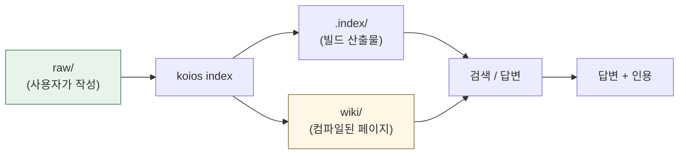
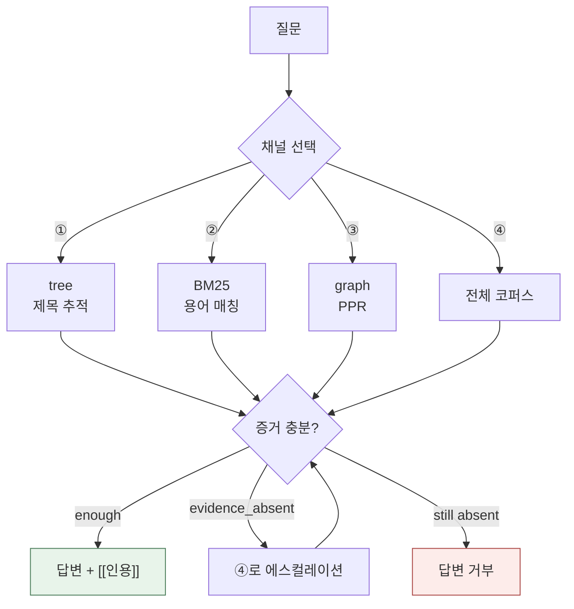
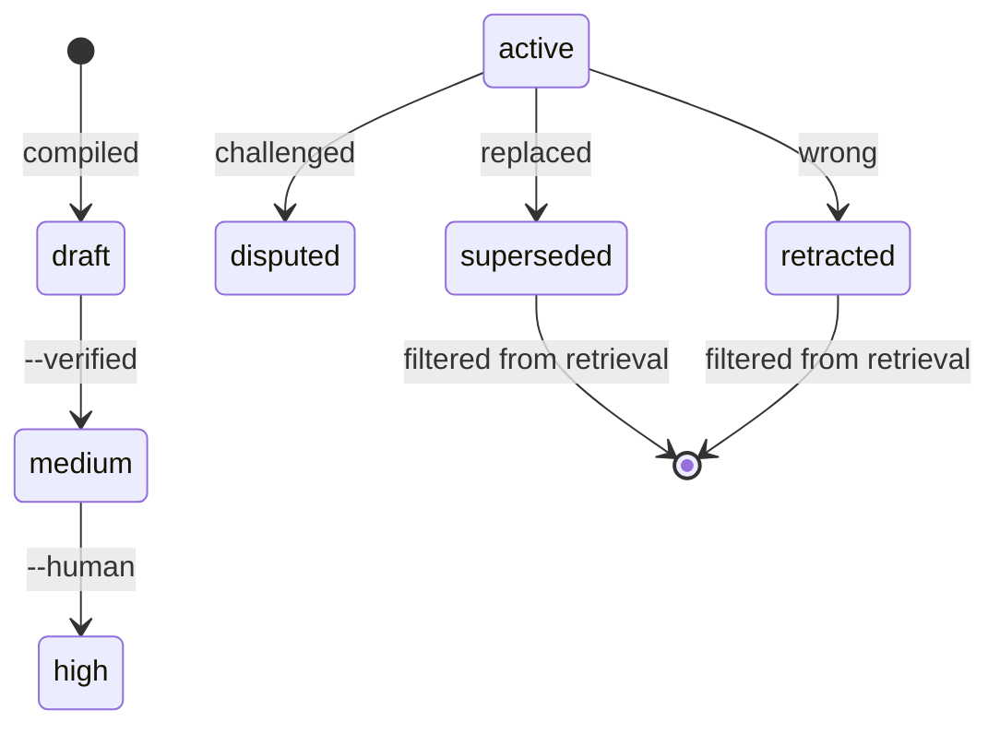

[](https://github.com/DeepTrial/KoiosBase/actions/workflows/ci.yml)
[](https://github.com/DeepTrial/KoiosBase/releases)
[](../../LICENSE)

[中文](../../README.md) | [English](README.en.md) | [Français](README.fr.md) | [Español](README.es.md) | [日本語](README.ja.md) | [한국어](README.ko.md)

# KoiosBase

Markdown 네이티브 LLM 지식 베이스입니다. Markdown을 작성하면 KoiosBase가 색인하고,
모든 답변은 그 출처 블록을 가리킵니다.

```console
$ koios search "revenue" -p myvault
[0] report.md#Financials/Revenue/1
    2024 Annual Report > Financials > Revenue
    ACME Corp revenue in 2024 was 3.2 billion yuan, up 12 percent.
[1] sources/report.md#2024 Annual Report/覆盖章节/1
    2024 Annual Report > 2024 Annual Report > 覆盖章节
    - Financials (`report.md#Financials`) - Revenue (`report.md#Financials/Revenue`) - Cash Flow (`report.md#Finan
[2] sources/report.md#2024 Annual Report/本文档能回答的问题/1
    2024 Annual Report > 2024 Annual Report > 本文档能回答的问题
    - 关于「Financials」，本文档有哪些说明？ (report.md#Financials) - 关于「Revenue」，本文档有哪些说明？ (report.md#Financials/Revenue) - 关于「
[3] sources/report.md#2024 Annual Report/导读摘要/1
    2024 Annual Report > 2024 Annual Report > 导读摘要
    ACME Corp revenue in 2024 was 3. 2 billion yuan, up 12 percent. Operating cash flow was positive for the year.
```

- **Markdown이 곧 진실입니다.** 색인은 빌드 산출물입니다. 지워도 바이트 단위까지
  동일하게 재구성됩니다.
- **지식에는 생애주기가 있습니다.** 블록을 retract하면 이를 인용한 모든 페이지가
  stale로 표시되고 답변을 멈춥니다.



## 설치

단일 Rust 바이너리이며 **런타임 의존성이 없습니다**.

```bash
curl -LO https://github.com/DeepTrial/KoiosBase/releases/latest/download/koios-linux-x86_64
chmod +x koios-linux-x86_64
# 또는 소스에서 빌드 (MuPDF bindgen에는 libclang이 필요합니다)
git clone https://github.com/DeepTrial/KoiosBase && cd KoiosBase
cargo build --release --manifest-path rust-cli/Cargo.toml
```

```console
$ koios init demo && koios index demo && koios lint demo
initialized KoiosBase vault at demo
indexed 0 blocks from demo
---- lint: 0 finding(s)
```

### LLM 연결 (선택)

모델 없이도 동작합니다. 내장 생성기는 인용된 검색 블록만 반환하며 절대
지어내지 않습니다. 모델을 추가하려면 `koios config --init -p myvault`를 실행하고
`koios.toml`을 작성합니다:

```toml
[model]
base_url = "https://api.openai.com/v1"
model = "gpt-4o-mini"
api_key_env = "OPENAI_API_KEY"     # 환경 변수의 '이름'이며, 키 자체가 아닙니다
```

OpenAI 프로토콜을 말하는 모든 엔드포인트를 쓸 수 있습니다(`kind = "openai"`, 기본값): OpenAI, Ollama, vLLM, DeepSeek, Moonshot, LiteLLM — 그리고 Claude를 프록시하는 게이트웨이(뒤의 모델과 무관하게 이 형식을 제공합니다). Anthropic 자체 엔드포인트만 `kind = "anthropic"`이 필요합니다.

안전장치는 사용자의 모델에도 적용됩니다 — 인용 누락은 조용히 수용되지 않고
보고되며, 모델 실패는 지어낸 답변이 아니라 오류입니다:

```console
$ koios query "revenue" -p myvault --llm-cmd 'printf "%s" "Revenue was 3.2 billion yuan."'
verdict: enough  hits: 3  escalated: false
Revenue was 3.2 billion yuan.
[contracts] citation=0/1 sentences cited
```

## 사용법

```console
$ koios init myvault                            # vault 생성
$ koios index myvault                           # raw/ 편집 후마다
$ koios search "revenue" -p myvault             # 검색
$ koios query  "revenue" -p myvault             # 전체 파이프라인 + verdict
verdict: enough  hits: 4  escalated: false
[0] report.md#Financials/Revenue/1
    ACME Corp revenue in 2024 was 3.2 billion yuan, up 12 percent.
[1] sources/report.md#2024 Annual Report/覆盖章节/1
    - Financials (`report.md#Financials`)
- Revenue (`report.md#Financials/Revenue`)
- Cash Flow (`report.md#Finan
[2] sources/report.md#2024 Annual Report/本文档能回答的问题/1
    - 关于「Financials」，本文档有哪些说明？ (report.md#Financials)
- 关于「Revenue」，本文档有哪些说明？ (report.md#Financials/Revenue)
- 关于「
[3] sources/report.md#2024 Annual Report/导读摘要/1
    ACME Corp revenue in 2024 was 3. 2 billion yuan, up 12 percent. Operating cash flow was positive for the year.
$ koios compile -p myvault                      # 구조화된 페이지 컴파일
compiled: entities=2 entity_pages=2 source_pages=1 affected_pages=5 stamp=2026-10-10
$ koios studio brief -p myvault -t revenue      # 내보내기
wrote myvault/wiki/synthesis/brief-revenue.md
$ koios mcp --install codex                     # MCP 호스트에 등록
```

검색은 질문마다 채널을 선택하고, 답변하기 전에 증거가 충분한지 먼저 묻습니다:



**ACL**: `--groups finance-team`이 principal을 설정합니다. 지정하지 않으면
익명이며 제한된 문서는 보이지 않습니다 — 이것이 설계입니다.

**vault 구조**: `raw/`(사용자가 작성), `wiki/`(생성됨, 커밋 대상),
`.index/`(빌드 산출물, 커밋 금지).

## 유지보수

| 작업 | 명령 |
| --- | --- |
| `raw/` 편집 후 | `koios index myvault` |
| 상태 점검 | `koios lint myvault` |
| 업그레이드 후 | `koios index myvault --full` |
| 사실이 틀렸을 때 | `koios retract -p myvault -b "block-id" --reason "..."` |
| 신뢰도 상승 | `koios promote --human-confirmed "wiki/entities/acme.md"` |

```console
$ koios retract -p myvault -b "report.md#Financials/Revenue/1" --reason "wrong figure"
retracted report.md#Financials/Revenue/1; affected pages: 3 ["entities/acme-corp.md", "entities/acme.md", "synthesis/brief-revenue.md"]
```



신뢰도는 생성기 외부의 증거로만 올라갑니다(§5.4 — 인용 개수로는 절대 올리지
않습니다): `draft → medium → high`.

## 문서

- `docs/KoiosBase设计文档v1.3.md` — 설계 기준선
- `docs/python-rust-parity.md` — 포팅 감사 추적
- `docs/known-gaps.md` — 알려진 한계와 제약
- `docs/i18n.md` — 번역 규칙
- `AGENTS.md` — 모든 vault에 기록되는 계약

MIT — [LICENSE](../../LICENSE) 참조.
