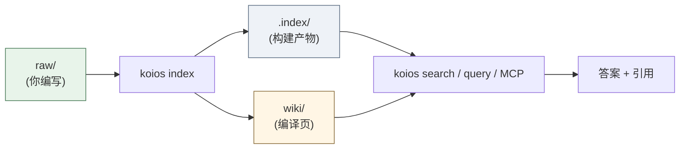
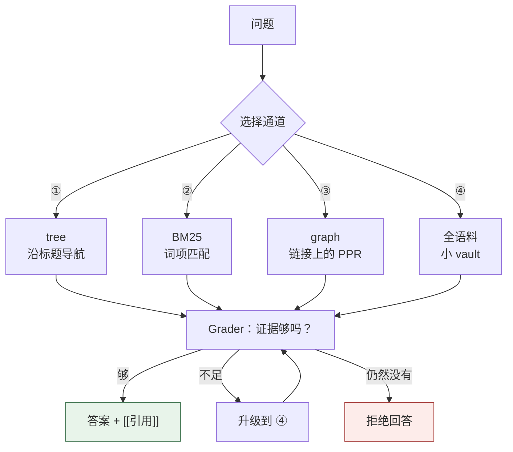
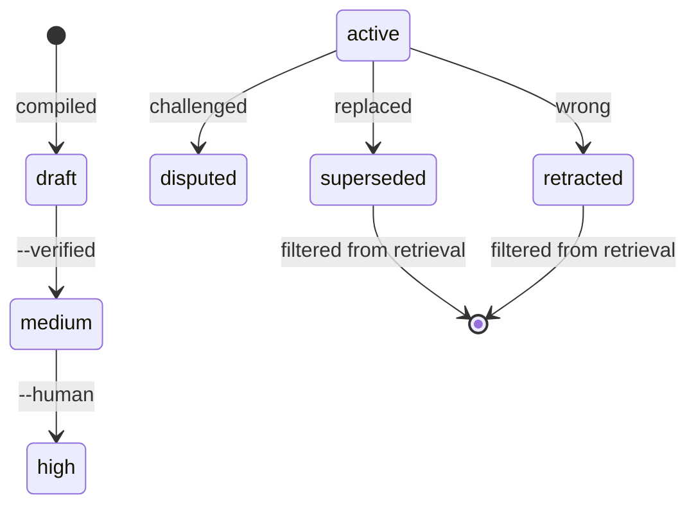
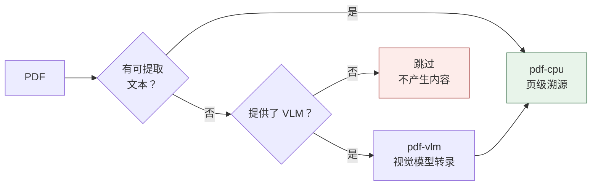

[](https://github.com/DeepTrial/KoiosBase/actions/workflows/ci.yml)
[](https://github.com/DeepTrial/KoiosBase/releases)
[](../../LICENSE)

[English](../../README.md) | [中文](README.zh.md) | [日本語](README.ja.md)

# KoiosBase

一个 Markdown 原生的 LLM 知识库。你写 Markdown，KoiosBase 为其建立索引，
返回的每个答案都指向它所来自的确切块。

```console
$ koios search "revenue" -p myvault
[0] report.md#Financials/Revenue/1
    2024 Annual Report > Financials > Revenue
    ACME Corp revenue in 2024 was 3.2 billion yuan, up 12 percent.
[1] sources/report.md#2024 Annual Report/覆盖章节/1
    2024 Annual Report > 2024 Annual Report > 覆盖章节
    - Financials (`report.md#Financials`) - Revenue (`report.md#Financials/Revenue`) - Cash Flow (`report.md#Finan
[2] sources/report.md#2024 Annual Report/本文档能回答的问题/1
    2024 Annual Report > 2024 Annual Report > 本文档能回答的问题
    - 关于「Financials」，本文档有哪些说明？ (report.md#Financials) - 关于「Revenue」，本文档有哪些说明？ (report.md#Financials/Revenue) - 关于「
[3] sources/report.md#2024 Annual Report/导读摘要/1
    2024 Annual Report > 2024 Annual Report > 导读摘要
    ACME Corp revenue in 2024 was 3. 2 billion yuan, up 12 percent. Operating cash flow was positive for the year.
```

让它区别于「切块 + 嵌入 + top-k」的有两点：

- **Markdown 就是事实本身。** 索引是构建产物——删掉它，`koios index` 会逐字节
  重建。重要的东西不存在于数据库里。
- **知识有生命周期。** 把一个块标记为 `retracted`，它会传播：每个引用它的页面
  被标记为 stale，它也不再参与回答。



---

## 安装

单个 Rust 二进制，**无运行时依赖**——SQLite 已编译进二进制。

```bash
# 方式 A — 预构建二进制
curl -LO https://github.com/DeepTrial/KoiosBase/releases/latest/download/koios-linux-x86_64
chmod +x koios-linux-x86_64

# 方式 B — 从源码构建（MuPDF bindgen 需要 libclang）
git clone https://github.com/DeepTrial/KoiosBase && cd KoiosBase
cargo build --release --manifest-path rust-cli/Cargo.toml
```

```console
$ koios init demo && koios index demo && koios lint demo
initialized KoiosBase vault at demo
indexed 0 blocks from demo
---- lint: 0 finding(s)
```

---

## 用法

**1. 创建 vault** — `koios init myvault`

```text
myvault/
  raw/          你的文档            <- 你维护这个
  wiki/         编译出的页面        <- 生成的，不要手改
  .index/       构建产物            <- 永远不要提交
  koios.toml    可选的模型配置
```

**2. 添加文档** 到 `myvault/raw/`。frontmatter 可选，但信任元数据写在那里：

```markdown
---
title: 2024 Annual Report
acl: [finance-team]     # 可选：限制到某个组
ttl: 365d               # 可选：时效窗口
---

# Financials

## Revenue

ACME Corp revenue in 2024 was 3.2 billion yuan, up 12 percent.
```

**3. 建索引** —— 每次编辑后运行。增量且幂等，随意运行：

```bash
koios index myvault
```



**4. 检索与提问：**

```bash
koios search "revenue" -p myvault                    # BM25 + graph，取前 8
koios search "revenue" -p myvault -k 20              # 更多结果
koios search "revenue" -p myvault -c tree            # 强制通道 ①
koios search "revenue" -p myvault --groups finance-team
koios query  "revenue" -p myvault                    # 完整管线 + verdict
```

`-c` 接受 `hybrid`（默认）、`tree`、`full`、`graph`。`--groups` 设定你的 ACL
主体；不给则你是匿名用户，受限文档对你不可见——这是设计，不是故障。

```console
$ koios query "revenue" -p myvault
verdict: enough  hits: 4  escalated: false
[0] report.md#Financials/Revenue/1
    ACME Corp revenue in 2024 was 3.2 billion yuan, up 12 percent.
[1] sources/report.md#2024 Annual Report/覆盖章节/1
    - Financials (`report.md#Financials`)
- Revenue (`report.md#Financials/Revenue`)
- Cash Flow (`report.md#Finan
[2] sources/report.md#2024 Annual Report/本文档能回答的问题/1
    - 关于「Financials」，本文档有哪些说明？ (report.md#Financials)
- 关于「Revenue」，本文档有哪些说明？ (report.md#Financials/Revenue)
- 关于「
[3] sources/report.md#2024 Annual Report/导读摘要/1
    ACME Corp revenue in 2024 was 3. 2 billion yuan, up 12 percent. Operating cash flow was positive for the year.
```

**5. 编译** 出结构化页面：

```console
$ koios compile -p myvault
compiled: entities=2 entity_pages=2 source_pages=1 affected_pages=5 stamp=2026-10-10
```

把实体写入 `wiki/entities/`，把每篇文档的导读写入 `wiki/sources/`。
**重新编译会保留页面已提升的置信度和任何人工撰写的笔记。**

**6. 导出** —— 文件落到磁盘，所以同样遵守 ACL：

```console
$ koios studio brief   -p myvault -t revenue
wrote myvault/wiki/synthesis/brief-revenue.md
$ koios studio mindmap -p myvault -t Financials
wrote myvault/wiki/synthesis/mindmap-financials.md
```

**7. 通过 MCP 服务 agent** —— `koios mcp` 在 stdio 上说 JSON-RPC 2.0，暴露
`koios_search`、`koios_ask`、`koios_write_answer`。用注册命令而不是手写 JSON：

```bash
koios mcp --install            # PATH 上找到的所有宿主
koios mcp --install codex      # 或指定一个
```

这还会安装一份 `SKILL.md`，教给模型唯一要紧的规则：**没有引用的答案意味着
vault 里没有，不要用自己的知识去填这个空。**

---

## 接入 LLM

开箱状态下 KoiosBase 只依据检索到的块作答：内置生成器返回带引用的前几个块，
从不编造。默认行为必须在零配置下就可信。

```bash
koios config --init -p myvault && $EDITOR myvault/koios.toml
```

```toml
[model]
base_url = "https://api.openai.com/v1"
model = "gpt-4o-mini"
api_key_env = "OPENAI_API_KEY"     # 环境变量的「名字」，绝不是密钥本身
```

**闸门对你的模型同样生效**——把模型交给它不等于允许它编造。缺引用会被报告，
而不是静默接受（下面是同一个 vault 执行了 `retract` 之后的状态，所以是 `hits: 3`）：

```console
$ koios query "revenue" -p myvault --llm-cmd 'printf "%s" "Revenue was 3.2 billion yuan."'
verdict: enough  hits: 3  escalated: false
Revenue was 3.2 billion yuan.
[contracts] citation=0/1 sentences cited
```

模型失败是一个错误，绝不是一个编造的答案：

```console
$ koios query "revenue" -p myvault     # api_key_env 指向一个未设置的变量
verdict: enough  hits: 3  escalated: false
model config names api_key_env = "OPENAI_API_KEY" but that variable is not set
```

检索保持权威：受限文档在模型看到任何东西**之前**就已被移除，所以模型不可能
泄露它从未拿到的内容。

### 作为库使用

```rust
use koios::pipeline::full_query_with;
use koios::connect;

let conn = connect(std::path::Path::new("myvault")).unwrap();
let my_llm = |question: &str, context: &str| -> Result<String, String> {
    Ok(call_your_model(context))     // OpenAI、Anthropic、本地模型，任何都行
};
let result = full_query_with(&conn, "revenue", 8,
                             Some(&["finance-team".into()]), Some(&my_llm));
println!("{}", result.answer);
println!("{:?}", result.violations);   // 契约满足时为空
```

可调用对象的契约是 `Fn(&str, &str) -> Result<String, String>`（别名为
`koios::pipeline::LlmFn`）。代码库里没有任何供应商适配器或 API key 处理——
没有厂商被内建进去。

---

## 维护

| 任务 | 命令 |
| --- | --- |
| 编辑 `raw/` 之后 | `koios index myvault` |
| 健康检查 | `koios lint myvault` |
| 升级之后 | `koios index myvault --full` |

`koios lint` 报告断链、无源断言、过期 TTL、stale 页和孤儿页。程序化（L1），
不涉及模型，便宜到可以放进 CI。

### 更正错误

用 retract，而不是绕着它改：

```console
$ koios retract -p myvault -b "report.md#Financials/Revenue/1" --reason "wrong figure"
retracted report.md#Financials/Revenue/1; affected pages: 3 ["entities/acme-corp.md", "entities/acme.md", "synthesis/brief-revenue.md"]
```

该块停止参与回答，每个引用它的页面被标记 stale，原因被记录。retract 一个
**受限**块需要带 `--groups` 且持有相应授权。



### 提升编译页

页面从 `confidence: draft` 起步；提升它需要生成器自身之外的证据
（§5.4 —— 绝不算引用条数）：

```bash
cd myvault                                    # promote 接受的是文件系统路径
koios promote --verified        "wiki/entities/acme.md"   # -> medium
koios promote --human-confirmed "wiki/entities/acme.md"   # -> high
```

`draft → medium → high`。

### 日常打理

- **永远不要提交 `.index/`** —— 它是派生的。**要提交 `wiki/`** —— 版本化的
  Markdown。
- **备份 `raw/`** —— 唯一不可替代的目录。

---

## 多模态（视觉）模型

PDF 按两档解析：始终可用的 CPU 文本档，以及只在页面看起来是扫描件时才启用的
**VLM 档**。



在 `koios.toml` 里加一段即可启用：

```toml
[model.vision]
model = "gpt-4o"
```

没有它，扫描页不产生任何内容——静默地，这是设计如此。为没人读过的页面编造
文本，比不索引它更糟。作为库使用时，可调用对象收到的是 **PNG 字节**，不是路径：

```rust
use koios::pdf::extract_pages;

let my_vlm = |_path: &str, png: &[u8]| -> Result<String, String> {
    Ok(vision_model_transcribe(png))
};
let pages = extract_pages(std::path::Path::new("scan.pdf"), Some(&my_vlm));
```

PDF 之外的多模态输入（图片、图表作为一等来源）尚未实现——KoiosBase 是
Markdown 原生的，视觉只在文本提取失败时作为恢复路径进入。

---

## 概念

| 术语 | 含义 |
| --- | --- |
| **vault** | 根目录：`raw/` + `wiki/` + `.index/` |
| **block** | 一个可引用段落，地址形如 `doc.md#Section/1` |
| **layer** | `raw`（人工撰写）对 `wiki`（编译得出） |
| **channel** | 检索策略：① tree、② BM25、③ graph、④ corpus |
| **state** | `active / superseded / disputed / retracted / draft` |
| **stale** | 源已变动的编译页；仍可用，但被标记 |

七条原则约束着每一种机制：

- **P1** Markdown 是唯一事实源。
- **P2** 存储最细粒度；以任意粒度检索。
- **P3** 检索是导航与推理，不是相似度比赛。
- **P4** 知识在入库时综合，不按查询重算。
- **P5** 知识有状态；错误会传播，且可修复。
- **P6** 每条断言都能溯源到它的出处。
- **P7** 裁判必须在来源上区别于生成器。

---

## 已知缺口

记录在案的局限，不是疏漏。依赖这套系统前请先读。

- **模型只负责撰写答案。** 实体抽取、页面渲染、Grader 和 L2 裁判仍是确定性的
  ——配置了模型并不会升级它们。
- **`needs_llm` 用例。** `koios eval` 会报告「关键词命中但没有真答案」的问题。
  需要 v0.3 的跨族 Grader。
- **L2 裁判只是占位。** 只能判定程序化关系（数字），其余一律返回 `unknown`。
- **stale 后的异步重编译未实现。** stale 页会被披露并降权，但重编译不会自动
  触发。
- **编译写集是 O(corpus)。** 正确性已解决，缩小写集是记录在案的债。
- **Windows 二进制只做了结构性验证。** 是合法的 PE32+，但没有 Windows runner
  或 Wine 可执行验证它。

以下为 `tests/channels_eval.rs` 所用 fixture 的真实输出：

```console
$ koios eval -p myvault
total=5 recall@1=0.600 refusal_acc=0.500 citation_cov=0.434 needs_llm=1
  SKIP [needs-llm] 公司是否披露了季度分红政策？ -> keyword evidence cannot decide this in v0.1 (2 blocks)
$ koios checkclaim "revenue 3.2bn" "revenue was 3.2 billion yuan"
entailed
```

---

## 目录结构

```text
KoiosBase/
  rust-cli/
    src/
      lib.rs        块模型、解析器、索引器、connect()
      ingest.rs     raw + wiki -> 派生索引
      pdf.rs        MuPDF 适配器（CPU + VLM 双档）
      retrieval.rs  BM25、RRF 融合、个性化 PageRank
      pipeline.rs   检索 -> 组装 -> 生成，契约
      compile.rs    实体页 + 来源页，质量闸门，综合
      state.rs      知识状态机与级联
      lint.rs       L1 守园人
      acl.rs        ACL / 多租户
      mcp.rs        stdio 上的 JSON-RPC
      studio.rs     brief / mindmap 导出
      main.rs       命令行接口
    tests/          20 个集成测试套件（146 个测试）
  docs/             设计基线、i18n 布局、parity 审计
  docs/i18n/        本 README 的中日文版本
```

## 文档

- `docs/KoiosBase设计文档v1.3.md` —— 设计基线（中文）
- `docs/python-rust-parity.md` —— 移植工作的审计轨迹
- `docs/i18n.md` —— 翻译布局
- `AGENTS.md` —— 写进每个 vault 的契约

## 许可

MIT —— 见 [LICENSE](../../LICENSE)。
