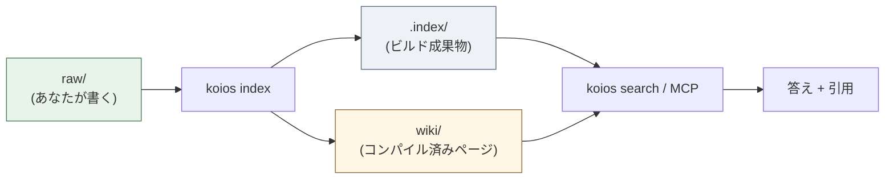
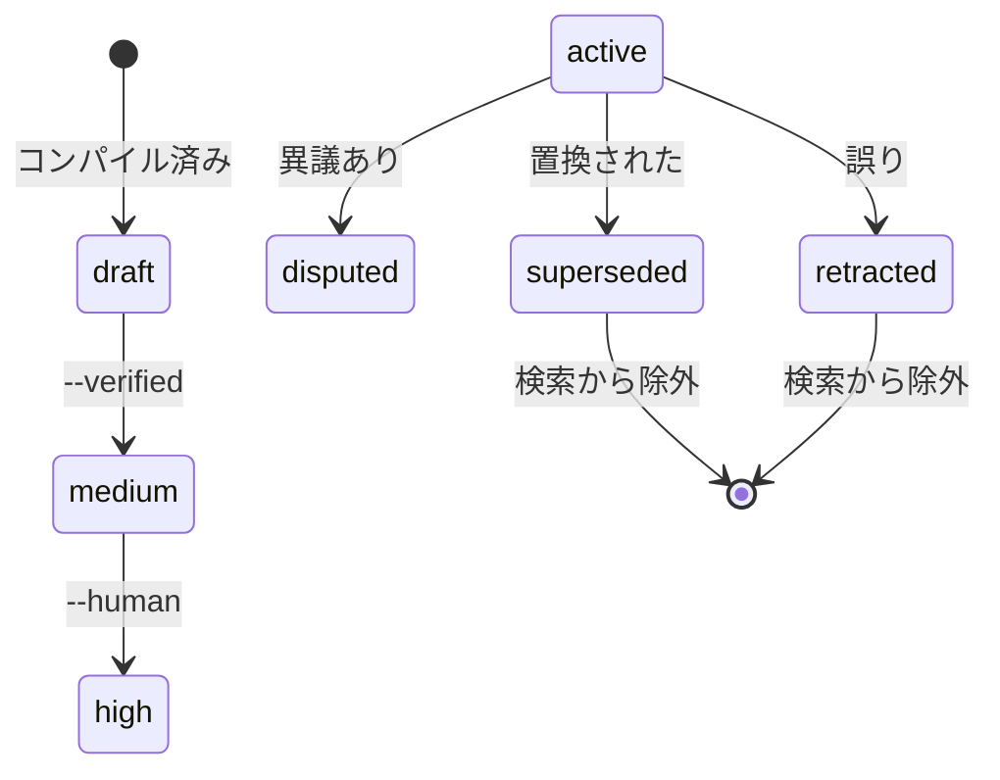
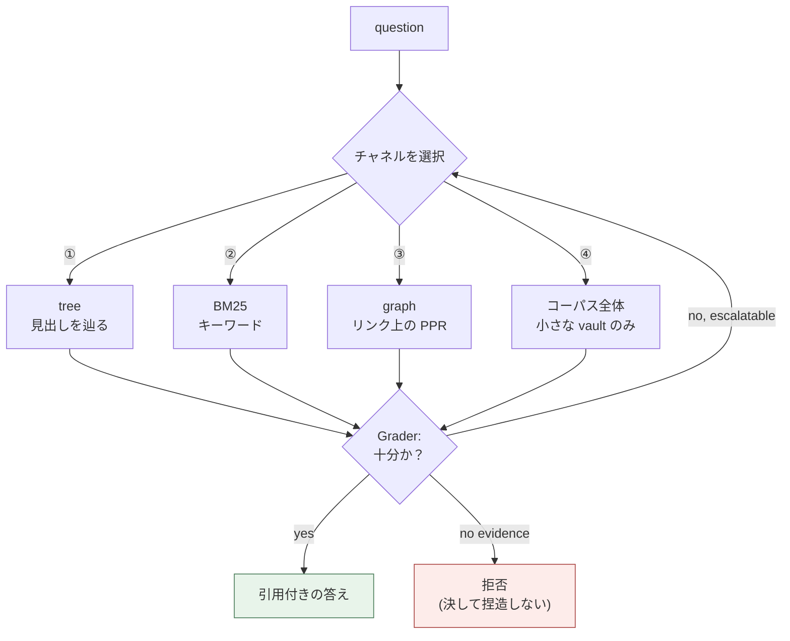
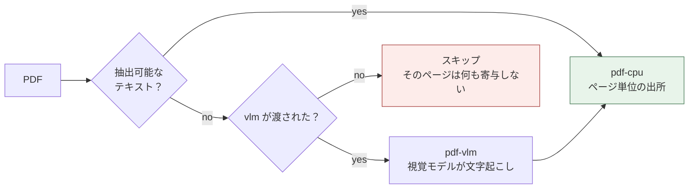

[](https://github.com/DeepTrial/KoiosBase/actions/workflows/ci.yml)
[](https://github.com/DeepTrial/KoiosBase/releases)
[](LICENSE)

[English](README.md) | [中文](i18n/README.zh.md) | [日本語](i18n/README.ja.md)

# KoiosBase

Markdown ネイティブな LLM ナレッジベースです。あなたの vault は Markdown ファ
イルのフォルダです。あなたが書き、KoiosBase がインデックスし、返ってくる答え
には必ず元のブロックを指す引用が付きます。

```console
$ koios search "revenue" -p myvault
[0] report.md#Financials/Revenue/1
    2024 Annual Report > Financials > Revenue
    ACME Corp revenue in 2024 was 3.2 billion yuan, up 12 percent.
[1] sources/report.md#2024 Annual Report/覆盖章节/1
    2024 Annual Report > 2024 Annual Report > 覆盖章节
    - Financials (`report.md#Financials`) - Revenue (`report.md#Financials/Revenue`)
[2] sources/report.md#2024 Annual Report/导读摘要/1
    2024 Annual Report > 2024 Annual Report > 导读摘要
    ACME Corp revenue in 2024 was 3. 2 billion yuan, up 12 percent.
```

すべてのヒットは自分のブロックアドレスと完全なパンくずリストを伴うため、
`[[wikilink]]` 形式で引用でき、リンクは解決されます。

「チャンク分割 + 埋め込み + top-k」と違う点は二つあります：

- **Markdown が真実である。** インデックスはビルド成果物です——削除しても
  `koios index` がバイト単位で同じものを再構築します。重要なものはデータベース
  の中だけに存在しません。
- **知識にはライフサイクルがある。** ブロックは `retracted` とマークでき、それ
  は伝播します——それを引用するすべてのページが stale とフラグされ、質問に答え
  なくなります。

---

## 仕組み

Markdown を入れ、引用付きの答えを出します。インデックスはビルド成果物なので、
流れは常に一方向です：



信頼は一つのスコアではなく二つの階段で蓄積されます。コンパイル済みページは低く
始まり、生成者自身が作っていない証拠によってのみ昇格します。ブロックは撤回で
き、それはそれを引用するすべてのページへ伝播します。



検索は常に同じことするのではなくチャネルを選び、答える前に証拠が十分かを
自問します：



---

## インストール

KoiosBase は単一の Rust バイナリで、**実行時依存なし**——Python もインタプリタも
PyMuPDF も不要。SQLite は `rusqlite` の bundled feature で静的に組み込まれる。

### 選択肢 A — ビルド済みバイナリ

各 [リリース](https://github.com/DeepTrial/KoiosBase/releases) には二つの
バイナリが同梱されています：

| ファイル | プラットフォーム |
| --- | --- |
| `koios-linux-x86_64` | Linux、musl 静的——どこでも動作 |
| `koios-windows-x86_64.exe` | Windows x86-64 |

```bash
curl -LO https://github.com/DeepTrial/KoiosBase/releases/latest/download/koios-linux-x86_64
chmod +x koios-linux-x86_64
./koios-linux-x86_64 --help
```

### 選択肢 B — ソースからビルド

```bash
git clone https://github.com/DeepTrial/KoiosBase && cd KoiosBase
cargo build --release --manifest-path rust-cli/Cargo.toml
./rust-cli/target/release/koios --help
```

`mupdf-sys` は MuPDF をソースからビルドするため、bindgen 用に libclang が
必要：`sudo apt-get install clang libclang-dev`（Debian/Ubuntu）。

### 検証

```console
$ koios init demo && koios index demo && koios lint demo
initialized KoiosBase vault at demo
indexed 0 blocks from demo
---- lint: 0 finding(s)
```

```bash
cargo test --release --manifest-path rust-cli/Cargo.toml   # 122 tests, green
```

---

## 使い方

### 1. vault を作成する

```bash
koios init myvault
```

```
myvault/
  raw/               your documents   <- you maintain this
  wiki/              compiled pages   <- generated, do not hand-edit
    sources/ answers/ entities/ concepts/ synthesis/
  .index/            build artifact   <- never commit
  AGENTS.md          the maintenance contract
  koios.toml         optional model config（「LLM を接続する」を参照）
```

### 2. ドキュメントを追加する

Markdown または PDF ファイルを `myvault/raw/` に置きます。frontmatter は任意
ですが、信頼メタデータはここに書かれます：

```markdown
---
title: 2024 Annual Report
acl: [finance-team]        # optional: restrict to a group
ttl: 365d                  # optional: freshness window
valid_from: 2024-01-01
---

# Financials

## Revenue

ACME Corp revenue in 2024 was 3.2 billion yuan, up 12 percent.
```

見出しがセクションツリーになり、段落が引用可能なブロックになります。

### 3. インデックスを作成する

```bash
koios index myvault          # incremental, idempotent — run it freely
koios index myvault --full   # force a full rebuild
```

`raw/` を編集したら常にこれを実行してください。繰り返し実行しても安全で、
インデックスが勝手に肥大化することはありません。

### 4. 検索と質問

```bash
koios search "revenue" -p myvault                  # BM25 + graph, top 8
koios search "revenue" -p myvault -k 20            # more results
koios search "revenue" -p myvault -c tree          # force channel ①
koios search "revenue" -p myvault --groups finance-team
```

`-c` は `hybrid`（デフォルト）、`tree`、`full`、`graph` を受け付けます。
`--groups` は ACL プリンシパルを設定します。指定しない場合は匿名となり、制限
されたドキュメントは見えなくなります——エラーではなく仕様です。

### 5. 構造化ページをコンパイルする

```bash
koios compile -p myvault
# compiled: entities=2 entity_pages=2 source_pages=1 affected_pages=4 stamp=2026-09-30
```

エンティティを `wiki/entities/` へ、ドキュメントごとの読み物ガイドを
`wiki/sources/` へ抽出します。再コンパイルしても、ページの昇格済み confidence
と人手のノートは保持されます。

### 6. エクスポート

```bash
koios studio brief  -p myvault -t revenue   --groups finance-team
# wrote myvault/wiki/synthesis/brief-revenue.md
koios studio mindmap -p myvault -t Financials --groups finance-team
# wrote myvault/wiki/synthesis/mindmap-financials.md
```

フラグに注意：`-t/--topic` が主題を設定し、動詞が先に来ます。これらは
`wiki/synthesis/` に書き込まれます。エクスポートは新しい主張を追加せず引用を
伴い、ACL も尊重します——エクスポートはディスク上のファイルなので、そこでの
漏洩はリクエストより長く残ります。

### 7. MCP でエージェントに提供する

```bash
koios mcp
```

stdio 経由で JSON-RPC 2.0 を話し、`koios_search`、`koios_ask`、
`koios_write_answer` を公開します。SDK 依存はなく、オフラインで動作します。

---

## LLM を接続する

既定では、KoiosBase は取得したブロックだけから回答します——組み込みの生成器は
引用付きの上位 3 ブロックを返し、決して捏造しません。これは意図的なものです。
既定の動作は設定なしでも信頼できなければなりません。

### 一度設定する —— `<vault>/koios.toml`

```bash
koios config --init -p myvault     # 雛形を書き出す
$EDITOR myvault/koios.toml
```

```toml
[model]
# OpenAI 互換のエンドポイントなら何でも：OpenAI、ローカル llama.cpp / vLLM /
# Ollama、社内プロキシ
base_url = "https://api.openai.com/v1"
model = "gpt-4o-mini"
api_key_env = "OPENAI_API_KEY"      # 環境変数の「名前」。キー本体ではない

# 任意：スキャンされた PDF ページ（§5.1 視覚層）
# [model.vision]
# model = "gpt-4o"

# 追加パラメータはそのままプロバイダへ渡される
temperature = 0.2

[retrieval]
top = 8
```

**キーはファイルに書かない。** `api_key_env` は変数名だけを指定し、値は呼び出し
時に読まれる——コミットされる vault が認証情報の漏えい源になってはならない。

`koios config` は実際に何が接続されているか（キーが設定済みかも）を表示します。
「モデルは接続されているか？」はこれなしには答えられません——打ち間違いがあると
決定的生成器のままになり、それは「接続済みだが証拠が見つからなかった」場合と
見分けがつかない。

```console
$ koios config -p myvault
config: myvault/koios.toml
  chat: gpt-4o-mini @ https://api.openai.com/v1
  api key: $OPENAI_API_KEY (set)
  vision: (none) — scanned pages are skipped
  retrieval.top: 8
```

モデルを使える全コマンドがこのファイルを読みます：`query`、`mcp`、そして
`index`（視覚層）。それ以外は何も変わらない——ファイルが無い、あるいは
`[model]` セクションが無ければ、以前とまったく同じ動作になる。

コードベースにベンダー SDK はありません。`ureq` は小さな HTTP クライアントで、
Wire 形式は OpenAI の chat 形状（ローカルサーバーもこれを話す）。ベンダーは
埋め込まれていません。HTTP ですらない場合の避難口が `model.command` です。

### ガードレールは依然として働く

**契約はあなたのモデルの出力にも適用されます**——KoiosBase にモデルを渡しても、
捏造できるようにはなりません。引用を省いた回答は、黙って受け入れられるのでは
なく報告されます：

```console
$ koios query "revenue" -p myvault --llm-cmd 'printf "%s" "Revenue was 3.2 billion yuan."'
verdict: enough  hits: 4  escalated: false
Revenue was 3.2 billion yuan.
[contracts] citation=0/1 sentences cited
```

モデルの失敗は捏造された回答ではなくエラーになります——キーが未設定の場合も：

```console
$ koios query "revenue" -p myvault
verdict: enough  hits: 4  escalated: false
model request failed: io: Connection refused (os error 111)

$ koios query "revenue" -p myvault       # api_key_env が指す変数が未設定
verdict: enough  hits: 4  escalated: false
model config names api_key_env = "OPENAI_API_KEY" but that variable is not set
```

### MCP 経由

`koios mcp` は同じファイルを読むので、サーバーを起動したエージェントは CLI と
同じモデルを得ます：

```bash
koios mcp
```

### 視覚層（スキャンされた PDF）

テキストを抽出できないページのために、同じファイルへもう一段追記します：

```toml
[model.vision]
model = "gpt-4o"
```

設定しなければ、スキャンされたページは何も貢献しません——黙って。それが意図された
既定動作です。誰も読んでいないページのテキストを捏造するほうが、索引しないより
悪い。`rust-cli/tests/vlm_tier.rs` がこの両面を固定しています。

### ライブラリとして

```rust
// Rust ライブラリ API —— 呼び出し可能オブジェクトは普通のクロージャ。
use koios::pipeline::{full_query_with, QueryResult};
use koios::connect;

let conn = connect(std::path::Path::new("myvault")).unwrap();
let my_llm = |question: &str, context: &str| -> Result<String, String> {
    Ok(call_your_model(context))     // OpenAI、Anthropic、ローカル、何でも
};
let result: QueryResult =
    full_query_with(&conn, "revenue", 8, Some(&["finance-team".into()]), Some(&my_llm));
println!("{}", result.answer);
println!("{:?}", result.violations);   // 契約が守られていれば空
```

呼び出し可能オブジェクトの契約は `Fn(&str, &str) -> Result<String, String>`
（`koios::pipeline::LlmFn` の別名）で、コードベースのどこにもプロバイダー
アダプターや API キー設定はありません——呼び出し可能オブジェクトはあなたが
渡すので、特定のベンダーが埋め込まれることはありません。`koios::llm` は CLI 自身に
よるこの契約の実装です：`generate_with(cmd, question, context)` は外部プロセスを
起動し、同じ `Result` を返します。

### アップグレードが解決するもの

既定の抽取モードには、LLM 経路が対処する 2 つの既知の弱点があります。`koios eval`
の `needs_llm` ケース（キーワードは一致するが実際の答えがない）と、ファミリを
またぐ判定（§P7——judge は生成器と出自が異ならなければならない）です。どちらも
既知のギャップに記載されています。

---

## 保守

### 日常

| タスク | コマンド |
| --- | --- |
| `raw/` を編集した後 | `koios index myvault` |
| ヘルスチェック | `koios lint myvault` |

`koios lint` は壊れた wikilink、出典のない主張、期限切れ TTL、stale ページ、
孤立ページを報告します。これはプログラム的（L1）で——モデルを使わないため
CI で実行できるほど軽量です。

### 間違いを訂正する

事実が間違っていると分かったら、編集でごまかさず**撤回**してください：

実出力：

```console
$ koios retract -p myvault -b "report.md#Financials/Revenue/1" --reason "wrong figure"
retracted report.md#Financials/Revenue/1; affected pages: 2
["wiki/entities/acme-corp.md", "wiki/entities/acme.md"]
$ cd myvault && koios promote --verified "wiki/entities/acme.md"
medium
```

これは三つのことを行います：そのブロックが質問に答えなくなる（すべての検索経路
から除外される）、それを引用するすべてのページが stale とマークされる、そして
理由が記録されます。検索出力が、それを引用するページの中でそのブロックの id を
*引用*することはあります——それは引用であり、答えではありません。ソースが更新
されたページは降格され、（待更新）とマークされます。

### コンパイル済みページを昇格する

コンパイル済みページは `confidence: draft` から始まります。昇格には生成者自身
由来でない証拠が必要です（§5.4——決して引用数ではありません）：

```bash
cd myvault          # promote takes a filesystem path, not a vault-relative one
koios promote --verified        "wiki/entities/acme.md"   # promoted: draft -> medium
koios promote --human-confirmed "wiki/entities/acme.md"   # promoted: medium -> high
```

`draft → medium → high`。

他のすべてのコマンドと異なり、`promote` は**カレントディレクトリからのファイル
システムパス**を取ります——`-p` フラグがないため、まず vault に `cd` してくだ
さい。結果の階層（`draft`/`medium`/`high`）を出力し、`--verified` も
`--human-confirmed` も指定しない場合は現在の階層をそのまま報告します。
昇格は再コンパイル後も保持されます。

### ハウスキーピング

- **`.index/` は決してコミットしない。** 派生成果物なので `.gitignore` に追加
  してください。
- **`wiki/` はコミットする。** コンパイル済みページはバージョン管理された
  Markdown なので、生成されるが追跡される他のファイルと同様に差分をレビュー
  してください。
- **`raw/` はバックアップする。** それが唯一かけがえのないディレクトリです。

### アップグレード

インデックス形式はコードと一緒にバージョン管理されています。アップグレード後は
次を再実行してください：

```bash
koios index myvault --full
```

---

## マルチモーダル（視覚）モデル

PDF は 2 層で解析されます（§5.1）。常に利用可能な CPU テキスト層と、**VLM tier**
です。後者はページがスキャンされたように見える場合——抽出可能なテキストのない
画像の場合——にのみ作動します。



VLM tier が重要なのは、OCR を使わないパイプラインがスキャンされたページを静かに
失うからです。PDF にスキャンされた契約書はキーワード検索にもすべての回答にも
見えなくなり、しかもエラーは出ません。ページ画像を視覚モデルに渡せばそれを
回復でき、回復されたテキストは CPU 層と同じページ単位の引用を伴います。

`koios.toml` にもう一段追記するだけです（「LLM を接続する」を参照）。ライブラリの
呼び出し可能オブジェクトとして渡す場合は、**PNG バイト**（パスではなく）を受け取ります：

```rust
// Rust ライブラリ API —— 呼び出し可能オブジェクトはパスではなく PNG バイトを受け取る。
use koios::pdf::extract_pages;

let my_vlm = |_path: &str, png: &[u8]| -> Result<String, String> {
    Ok(vision_model_transcribe(png))
};
let pages = extract_pages(std::path::Path::new("scan.pdf"), Some(&my_vlm));
```

実出力（2 ページの PDF。CPU 層がテキストを抽出できるため VLM スタブは呼ばれ
ません——これこそが 2 層 tier 設計の想定どおりの挙動です）：

```console
$ cargo run --release --manifest-path rust-cli/Cargo.toml \
    --example readme_vlm_snippet -- scan.pdf
2 page(s) extracted
```

この層は誇張しやすいため、正直な注意点を 2 つ挙げます：

- **`[model.vision]` 未設定のスキャンページは何も貢献しません**——黙って。これが
  意図された既定動作です。誰も読んでいないページのテキストを捏造するほうが、
  索引しないより悪い。
- **ラスタライズは同梱の MuPDF が行います。** PDF 読み取りが既に使っている
  依存と同じなので、追加のインストールは不要です。

`rust-cli/tests/vlm_tier.rs` が三つの挙動を端到端で固定しています：コマンドなし
では黙る、あれば回復する、視覚コマンドが失敗しても文書の残りを失わない。

PDF 以外のマルチモーダル入力——画像、グラフ、スクリーンショットをファーストクラスの
ソースとして扱うこと——は未実装です。KoiosBase は Markdown ネイティブであり（P1）、
視覚はテキスト抽出が失敗したときの回復経路としてのみ関与します。

---

## 概念（簡略版）

これらがなくても KoiosBase は使えますが、出力を理解する助けになります。

| 用語 | 意味 |
| --- | --- |
| **vault** | ルートディレクトリ：`raw/` + `wiki/` + `.index/` |
| **block** | 引用可能な段落または表、`doc.md#Section/1` としてアドレス指定 |
| **layer** | `raw`（人が書く）vs `wiki`（コンパイル済み） |
| **channel** | 検索戦略：① tree、② BM25、③ graph、④ コーパス全体 |
| **state** | `active / superseded / disputed / retracted / draft` |
| **stale** | ソースが変わったコンパイル済みページ。まだ使えるがフラグ付き |
| **VLM tier** | 抽出可能なテキストがない PDF ページを視覚モデルで回復する |

すべてのメカニズムを制約する七つの原理：

- **P1** Markdown が唯一の情報源である。
- **P2** 最小粒度で保存し、任意の粒度で検索する。
- **P3** 検索は导航と推論であり、類似度コンテストではない。
- **P4** 知識は ingest 時に合成され、クエリごとに再計算されない。
- **P5** 知識は状態を持ち、誤りは伝播し修復可能である。
- **P6** すべての主張は情報源まで監査可能である。
- **P7** 判定者は生成者と起源が異ならなければならない。

---

## 一つのシェル

KoiosBase は Python の参照実装として始まり、Rust に移植されました。Rust バイナリ
が今やリポジトリで**唯一**のシェルです：同じ vault 形式、同じコマンド面（16 の
サブコマンド）、そして実行時依存なし。PDF 層は MuPDF を AGPL または商用ライセンス
でリンクします —— これは PyMuPDF がかつて唯一の実行時依存として本プロジェクトに
既に与えていた立場と同じです。移植を証明した Python コードと差分ツールは、第二の
ランタイムではなく監査証跡として `docs/python-rust-parity.md` に残っています。

上の parity の主張はいずれも、空でないフィクスチャ上で二つの実装を突き合わせて
差分を取ることで導かれたものです —— 手法と再現用コマンドは
`docs/python-rust-parity.md` に記載されています。

`tests/channels_eval.rs` が使うフィクスチャでの実出力：

```console
$ koios eval -p myvault
total=5 recall@1=0.600 refusal_acc=1.000 citation_cov=0.348 needs_llm=0
$ koios checkclaim "revenue 3.2bn" "revenue was 3.2 billion yuan"
entailed
```

---

## 既知のギャップ

記録済みの限界であり、見落としではありません。本システムに依存する前に
お読みください。

- **`needs_llm` ケース。** `koios eval` は `needs_llm` 数を報告します。キーワード
  はヒットするが実際の答えが存在しない質問です（公司 に言及 ≠ 配当方針の質問に
  回答）。v0.3 のクロスファミリ Grader が必要です。
- **L2 judge はプレースホルダです。** プログラム的に検証可能な関係（数値）のみ
  を判定し、それ以外は `unknown` を返します。
- **コンパイルの書き込み集合は O(コーパス) です。** 正当性は解決済みですが、
  書き込みの絞り込みは技術的負債として記録されています。
- **stale 時の非同期再コンパイルは未実装です。** stale ページは開示され降格され
  ますが、再コンパイルは自動的に発火しません（§5.3 が可用性のブロックを禁じて
  いるため）。
- **Windows バイナリは構造的にのみ検証済みです。** 有効な PE32+ ですが、
  実行するための Windows ランナーも Wine も利用できませんでした。

---

## 構成

```text
KoiosBase/
  rust-cli/
    src/
      lib.rs        block モデル、パーサー、インデクサ、connect()
      ingest.rs     raw + wiki -> 派生インデックス
      pdf.rs        MuPDF ベースの PDF アダプタ（CPU + VLM の 2 層）
      retrieval.rs  BM25、RRF 融合、パーソナライズ PageRank
      pipeline.rs   retrieve -> assemble -> generate、契約
      compile.rs    エンティティ + sources ページ、品質ゲート、synthesis
      state.rs      知識状態マシンとカスケード
      lint.rs       L1 gardener
      acl.rs        ACL / マルチテナント
      mcp.rs        JSON-RPC over stdio
      studio.rs     brief / mindmap 書き出し
      main.rs       コマンドラインインターフェース
    examples/       本 README で引用している実行可能なスニペット
    tests/          19 の統合テストスイート（136 ケース）
  docs/             設計baseline、i18n 配置、parity 監査
  i18n/             本 README の中国語版と日本語版
```

## ドキュメント

- `docs/KoiosBase设计文档v1.3.md` — 完全な設計ベースライン（中国語）；v1.4 の見出しに実装との乖離を記載
- `docs/i18n.md` — 翻訳ドキュメントの構成規約（翻訳は `i18n/` に配置）
- `AGENTS.md` — 各 vault に書き込まれる保守契約

## ライセンス

MIT — [LICENSE](LICENSE) を参照してください。
