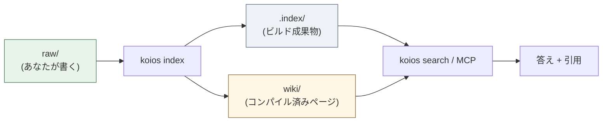
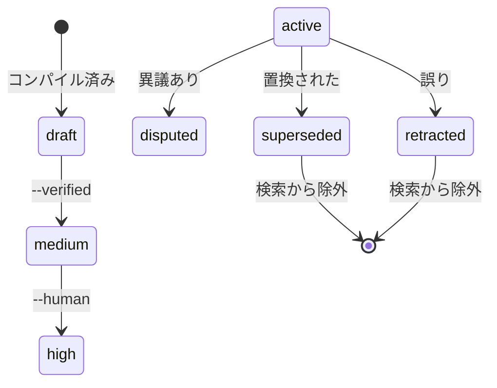
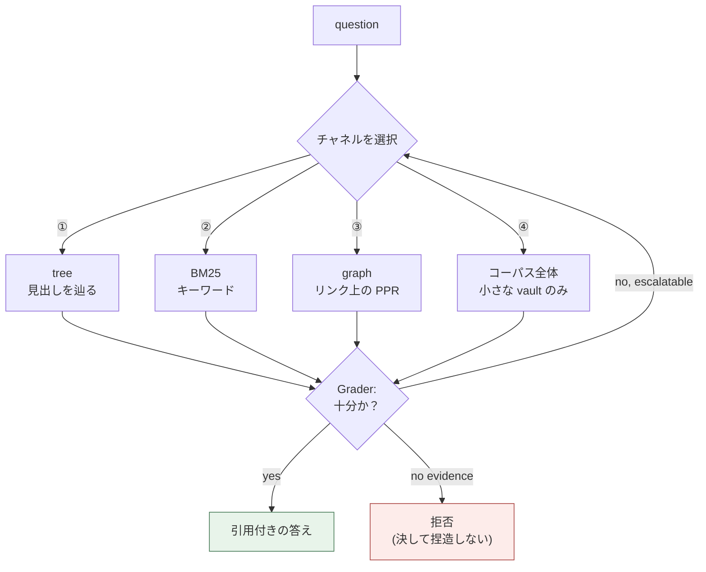

[](https://github.com/DeepTrial/KoiosBase/actions/workflows/ci.yml)
[](https://github.com/DeepTrial/KoiosBase/releases)
[](LICENSE)

[English](README.md) | [中文](i18n/README.zh.md) | [日本語](i18n/README.ja.md)

# KoiosBase

Markdown ネイティブな LLM ナレッジベースです。あなたの vault は Markdown ファ
イルのフォルダです。あなたが書き、KoiosBase がインデックスし、返ってくる答え
には必ず元のブロックを指す引用が付きます。

```console
$ koios search "revenue" -p myvault
[0] report.md#Financials/Revenue/1
    2024 Annual Report > Financials > Revenue
    ACME Corp revenue in 2024 was 3.2 billion yuan, up 12 percent.
[1] sources/report.md#2024 Annual Report/覆盖章节/1
```

すべてのヒットは自分のブロックアドレスと完全なパンくずリストを伴うため、
`[[wikilink]]` 形式で引用でき、リンクは解決されます。

「チャンク分割 + 埋め込み + top-k」と違う点は二つあります：

- **Markdown が真実である。** インデックスはビルド成果物です——削除しても
  `koios index` がバイト単位で同じものを再構築します。重要なものはデータベース
  の中だけに存在しません。
- **知識にはライフサイクルがある。** ブロックは `retracted` とマークでき、それ
  は伝播します——それを引用するすべてのページが stale とフラグされ、質問に答え
  なくなります。

---

## 仕組み

Markdown を入れ、引用付きの答えを出します。インデックスはビルド成果物なので、
流れは常に一方向です：



信頼は一つのスコアではなく二つの階段で蓄積されます。コンパイル済みページは低く
始まり、生成者自身が作っていない証拠によってのみ昇格します。ブロックは撤回で
き、それはそれを引用するすべてのページへ伝播します。



検索は常に同じことするのではなくチャネルを選び、答える前に証拠が十分かを
自問します：



---

## インストール

### 選択肢 A — pip（任意の OS、Python 3.10+ が必要）

```bash
pip install -e ".[test]"     # editable, from a clone
```

SQLite の FTS5 は CPython に同梱されているため、他にインストールするものは
ありません。

### 選択肢 B — ビルド済みバイナリ（Python 不要）

各 [リリース](https://github.com/DeepTrial/KoiosBase/releases) には二つの
バイナリが同梱されています：

| ファイル | プラットフォーム |
| --- | --- |
| `koios-linux-x86_64` | Linux、musl 静的——どこでも動作 |
| `koios-windows-x86_64.exe` | Windows x86-64 |

```bash
curl -LO https://github.com/DeepTrial/KoiosBase/releases/latest/download/koios-linux-x86_64
chmod +x koios-linux-x86_64
./koios-linux-x86_64 --help
```

### 検証

```bash
koios init demo && koios index demo && koios lint demo
# initialized KoiosBase vault at demo
# indexed 0 blocks from demo       <- empty vault, correct
# ---- lint: 0 finding(s)
```

---

## 使い方

### 1. vault を作成する

```bash
koios init myvault
```

```
myvault/
  raw/               your documents   <- you maintain this
  wiki/              compiled pages   <- generated, do not hand-edit
    sources/ answers/ entities/ concepts/ synthesis/
  .index/            build artifact   <- never commit
  AGENTS.md          the maintenance contract
```

### 2. ドキュメントを追加する

Markdown または PDF ファイルを `myvault/raw/` に置きます。frontmatter は任意
ですが、信頼メタデータはここに書かれます：

```markdown
---
title: 2024 Annual Report
acl: [finance-team]        # optional: restrict to a group
ttl: 365d                  # optional: freshness window
valid_from: 2024-01-01
---

# Financials

## Revenue

ACME Corp revenue in 2024 was 3.2 billion yuan, up 12 percent.
```

見出しがセクションツリーになり、段落が引用可能なブロックになります。

### 3. インデックスを作成する

```bash
koios index myvault          # incremental, idempotent — run it freely
koios index myvault --full   # force a full rebuild
```

`raw/` を編集したら常にこれを実行してください。繰り返し実行しても安全で、
インデックスが勝手に肥大化することはありません。

### 4. 検索と質問

```bash
koios search "revenue" -p myvault                  # BM25 + graph, top 8
koios search "revenue" -p myvault -k 20            # more results
koios search "revenue" -p myvault -c tree          # force channel ①
koios search "revenue" -p myvault --groups finance-team
```

`-c` は `hybrid`（デフォルト）、`tree`、`full`、`graph` を受け付けます。
`--groups` は ACL プリンシパルを設定します。指定しない場合は匿名となり、制限
されたドキュメントは見えなくなります——エラーではなく仕様です。

### 5. 構造化ページをコンパイルする

```bash
koios compile -p myvault
# compiled: entities=2 entity_pages=2 source_pages=1 affected_pages=4 stamp=2026-09-30
```

エンティティを `wiki/entities/` へ、ドキュメントごとの読み物ガイドを
`wiki/sources/` へ抽出します。再コンパイルしても、ページの昇格済み confidence
と人手のノートは保持されます。

### 6. エクスポート

```bash
koios studio brief  -p myvault -t revenue   --groups finance-team
# wrote myvault/wiki/synthesis/brief-revenue.md
koios studio mindmap -p myvault -t Financials --groups finance-team
# wrote myvault/wiki/synthesis/mindmap-Financials.md
```

フラグに注意：`-t/--topic` が主題を設定し、動詞が先に来ます。これらは
`wiki/synthesis/` に書き込まれます。エクスポートは新しい主張を追加せず引用を
伴い、ACL も尊重します——エクスポートはディスク上のファイルなので、そこでの
漏洩はリクエストより長く残ります。

### 7. MCP でエージェントに提供する

```bash
koios mcp
```

stdio 経由で JSON-RPC 2.0 を話し、`koios_search`、`koios_ask`、
`koios_write_answer` を公開します。SDK 依存はなく、オフラインで動作します。

---

## 保守

### 日常

| タスク | コマンド |
| --- | --- |
| `raw/` を編集した後 | `koios index myvault` |
| ヘルスチェック | `koios lint myvault` |

`koios lint` は壊れた wikilink、出典のない主張、期限切れ TTL、stale ページ、
孤立ページを報告します。これはプログラム的（L1）で——モデルを使わないため
CI で実行できるほど軽量です。

### 間違いを訂正する

事実が間違っていると分かったら、編集でごまかさず**撤回**してください：

```bash
koios retract -p myvault -b "report.md#Financials/Revenue/1" -r "wrong figure"
# retracted report.md#Financials/Revenue/1; affected pages: 2
# ['wiki/entities/acme-corp.md', 'wiki/entities/acme.md']
```

これは三つのことを行います：そのブロックが質問に答えなくなる（すべての検索経路
から除外される）、それを引用するすべてのページが stale とマークされる、そして
理由が記録されます。検索出力が、それを引用するページの中でそのブロックの id を
*引用*することはあります——それは引用であり、答えではありません。ソースが更新
されたページは降格され、（待更新）とマークされます。

### コンパイル済みページを昇格する

コンパイル済みページは `confidence: draft` から始まります。昇格には生成者自身
由来でない証拠が必要です（§5.4——決して引用数ではありません）：

```bash
cd myvault          # promote takes a filesystem path, not a vault-relative one
koios promote --verified "wiki/entities/acme.md"   # promoted: draft -> medium
koios promote --human    "wiki/entities/acme.md"   # promoted: medium -> high
```

`draft → medium → high`。

他のすべてのコマンドと異なり、`promote` は**カレントディレクトリからのファイル
システムパス**を取ります——`-p` フラグがないため、まず vault に `cd` してくだ
さい。フラグなしの場合は `not promoted (still draft): needs --verified or
--human` を出力し、終了コード 1 で終わります。昇格は再コンパイル後も保持され
ます。

### ハウスキーピング

- **`.index/` は決してコミットしない。** 派生成果物なので `.gitignore` に追加
  してください。
- **`wiki/` はコミットする。** コンパイル済みページはバージョン管理された
  Markdown なので、生成されるが追跡される他のファイルと同様に差分をレビュー
  してください。
- **`raw/` はバックアップする。** それが唯一かけがえのないディレクトリです。

### アップグレード

インデックス形式はコードと一緒にバージョン管理されています。アップグレード後は
次を再実行してください：

```bash
koios index myvault --full
```

---

## 概念（簡略版）

これらがなくても KoiosBase は使えますが、出力を理解する助けになります。

| 用語 | 意味 |
| --- | --- |
| **vault** | ルートディレクトリ：`raw/` + `wiki/` + `.index/` |
| **block** | 引用可能な段落または表、`doc.md#Section/1` としてアドレス指定 |
| **layer** | `raw`（人が書く）vs `wiki`（コンパイル済み） |
| **channel** | 検索戦略：① tree、② BM25、③ graph、④ コーパス全体 |
| **state** | `active / superseded / disputed / retracted / draft` |
| **stale** | ソースが変わったコンパイル済みページ。まだ使えるがフラグ付き |

すべてのメカニズムを制約する七つの原理：

- **P1** Markdown が唯一の情報源である。
- **P2** 最小粒度で保存し、任意の粒度で検索する。
- **P3** 検索は导航と推論であり、類似度コンテストではない。
- **P4** 知識は ingest 時に合成され、クエリごとに再計算されない。
- **P5** 知識は状態を持ち、誤りは伝播し修復可能である。
- **P6** すべての主張は情報源まで監査可能である。
- **P7** 判定者は生成者と起源が異ならなければならない。

---

## 二つのシェル、一つの vault

KoiosBase は Python 実装と Rust 実装を同梱しています。どちらも**同じ** vault
形式を読み書きするため、どちらでインデックスしどちらで検索しても構いません。

Python がリファレンス実装です。Rust バイナリも同じコマンド面を網羅し、共有
フィクスチャ上で Python の出力と照合されています（ブロック ID、パンくずリスト、
生成ページ、MCP 応答をバイト単位で比較）。

```bash
# Python CLI, full surface
koios eval -p myvault              # eval baseline
koios eval -p myvault --strict     # count known semantic gaps as failures
koios checkclaim "revenue 3.2bn" "revenue was 3.2 billion yuan"
```

---

## 既知のギャップ

記録済みの限界であり、見落としではありません。本システムに依存する前に
お読みください。

- **`needs_llm` ケース。** `koios eval` は `needs_llm` 数を報告します。キーワード
  はヒットするが実際の答えが存在しない質問です（公司 に言及 ≠ 配当方針の質問に
  回答）。v0.3 のクロスファミリ Grader が必要です。
- **L2 judge はプレースホルダです。** プログラム的に検証可能な関係（数値）のみ
  を判定し、それ以外は `unknown` を返します。
- **コンパイルの書き込み集合は O(コーパス) です。** 正当性は解決済みですが、
  書き込みの絞り込みは技術的負債として記録されています。
- **stale 時の非同期再コンパイルは未実装です。** stale ページは開示され降格され
  ますが、再コンパイルは自動的に発火しません（§5.3 が可用性のブロックを禁じて
  いるため）。
- **Windows バイナリは構造的にのみ検証済みです。** 有効な PE32+ ですが、
  実行するための Windows ランナーも Wine も利用できませんでした。

---

## 構成

```
koiosbase/
  core/        Block / Section / Document model
  parsers/     Markdown + PDF adapters
  ingest/      raw + wiki -> derived index
  index/       SQLite schema (tree, blocks, FTS, links)
  retrieval/   BM25, RRF fusion, personalized PageRank
  generation/  citation + refusal contracts, judge
  compile/     entity + source pages, quality gate
  state/       knowledge state machine and cascade
  lint/        L1 gardener
  query/       retrieve -> assemble -> generate
  security/    ACL / multi-tenancy
  mcp/         JSON-RPC over stdio
  studio/      brief / mindmap exports
  cli.py       command-line interface
rust-cli/      the Rust shell (same vault format)
```

## ドキュメント

- `docs/KoiosBase设计文档v1.3.md` — 完全な設計ベースライン（中国語）
- `docs/i18n.md` — 翻訳ドキュメントの構成規約（翻訳は `i18n/` に配置）
- `AGENTS.md` — 各 vault に書き込まれる保守契約

## ライセンス

MIT — [LICENSE](LICENSE) を参照してください。
