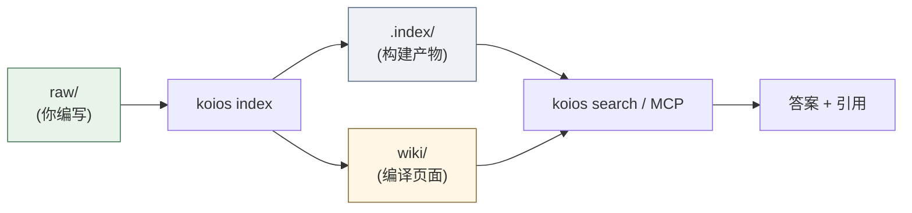
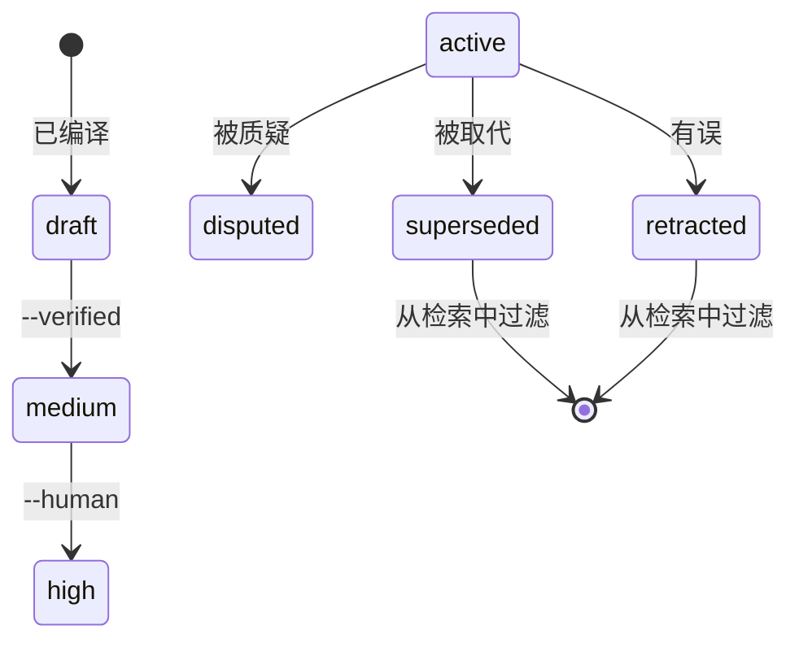
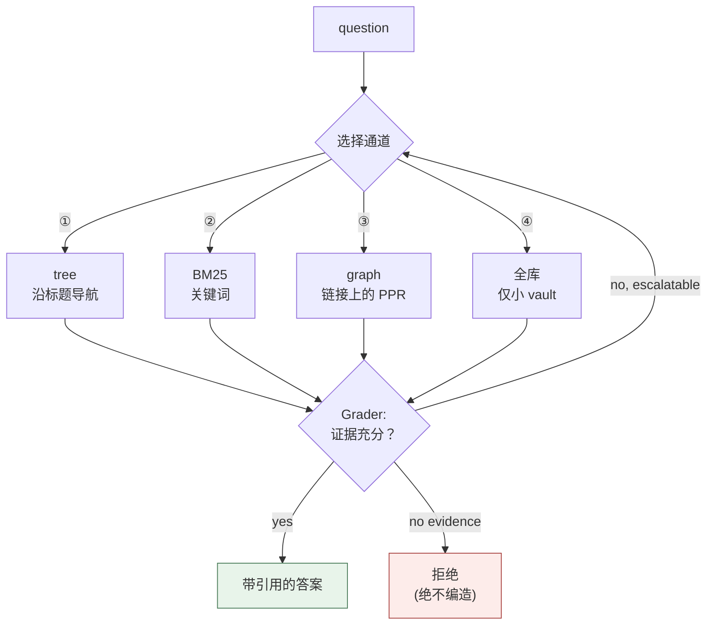
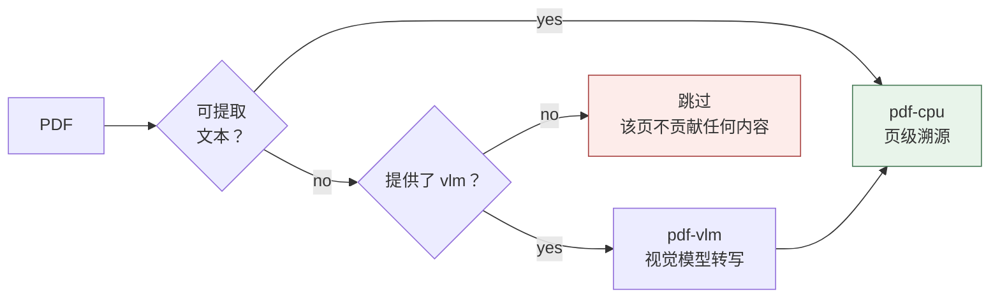

[](https://github.com/DeepTrial/KoiosBase/actions/workflows/ci.yml)
[](https://github.com/DeepTrial/KoiosBase/releases)
[](LICENSE)

[English](README.md) | [中文](i18n/README.zh.md) | [日本語](i18n/README.ja.md)

# KoiosBase

一个 Markdown 原生的 LLM 知识库。你的 vault 就是一个 Markdown 文件夹：
你编写它，KoiosBase 为其建立索引，返回的答案总是带指向确切来源块的引用。

```console
$ koios search "revenue" -p myvault
[0] report.md#Financials/Revenue/1
    2024 Annual Report > Financials > Revenue
    ACME Corp revenue in 2024 was 3.2 billion yuan, up 12 percent.
[1] sources/report.md#2024 Annual Report/覆盖章节/1
```

每条命中都带上自己的块地址和完整面包屑，因此你可以用 `[[wikilink]]` 形式引用它，
链接也能解析。

有两点让它不同于「切块 + 嵌入 + top-k」：

- **Markdown 就是真相。** 索引是构建产物——删掉它，`koios index` 能以字节级
  逐字重建。没有任何重要内容只存在于数据库中。
- **知识有生命周期。** 一个块可以被标记为 `retracted`，并且这会传播：引用它的
  每一页都会被标记为陈旧，它就不再回答问题。

---

## 工作原理

Markdown 进，带引用的答案出。索引是构建产物，所以流程始终是单向的：



信任沿着两条阶梯累积，而不是合成一个分数。编译页起点很低，只能由生成器自身
未曾产出的证据来晋升；一个块可以被撤回，并且这会传播到引用它的每一页。



检索会挑选通道，而不是永远做同一件事，并且在回答前先自问证据是否充分：



---

## 安装

### 方案 A — pip（任意操作系统，需要 Python 3.10+）

```bash
pip install -e ".[test]"     # editable, from a clone
```

SQLite 的 FTS5 已随 CPython 内置，因此没有其它需要安装的东西。

### 方案 B — 预编译二进制（无需 Python）

每个 [release](https://github.com/DeepTrial/KoiosBase/releases) 附带两个二进制：

| 文件 | 平台 |
| --- | --- |
| `koios-linux-x86_64` | Linux，musl 静态——任何环境都能跑 |
| `koios-windows-x86_64.exe` | Windows x86-64 |

```bash
curl -LO https://github.com/DeepTrial/KoiosBase/releases/latest/download/koios-linux-x86_64
chmod +x koios-linux-x86_64
./koios-linux-x86_64 --help
```

### 验证

```bash
koios init demo && koios index demo && koios lint demo
# initialized KoiosBase vault at demo
# indexed 0 blocks from demo       <- empty vault, correct
# ---- lint: 0 finding(s)
```

---

## 用法

### 1. 创建 vault

```bash
koios init myvault
```

```
myvault/
  raw/               your documents   <- you maintain this
  wiki/              compiled pages   <- generated, do not hand-edit
    sources/ answers/ entities/ concepts/ synthesis/
  .index/            build artifact   <- never commit
  AGENTS.md          the maintenance contract
```

### 2. 添加文档

把 Markdown 或 PDF 文件放进 `myvault/raw/`。frontmatter 是可选的，但信任元数据
就写在这里：

```markdown
---
title: 2024 Annual Report
acl: [finance-team]        # optional: restrict to a group
ttl: 365d                  # optional: freshness window
valid_from: 2024-01-01
---

# Financials

## Revenue

ACME Corp revenue in 2024 was 3.2 billion yuan, up 12 percent.
```

标题构成章节树；段落成为可引用的块。

### 3. 建立索引

```bash
koios index myvault          # incremental, idempotent — run it freely
koios index myvault --full   # force a full rebuild
```

在 `raw/` 中编辑任何内容之后运行它。重复运行是安全的，并且它自身永远不会让
索引无故增长。

### 4. 搜索与提问

```bash
koios search "revenue" -p myvault                  # BM25 + graph, top 8
koios search "revenue" -p myvault -k 20            # more results
koios search "revenue" -p myvault -c tree          # force channel ①
koios search "revenue" -p myvault --groups finance-team
```

`-c` 接受 `hybrid`（默认）、`tree`、`full`、`graph`。`--groups` 设定你的 ACL
主体；不带它就是匿名身份，受限文档对你不可见——这是设计使然，不是错误。

### 5. 编译结构化页面

```bash
koios compile -p myvault
# compiled: entities=2 entity_pages=2 source_pages=1 affected_pages=4 stamp=2026-09-30
```

把实体抽取到 `wiki/entities/`，把逐文档的阅读导读抽取到 `wiki/sources/`。
重新编译会保留页面已晋升的 confidence 以及任何人工撰写的笔记。

### 6. 导出

```bash
koios studio brief  -p myvault -t revenue   --groups finance-team
# wrote myvault/wiki/synthesis/brief-revenue.md
koios studio mindmap -p myvault -t Financials --groups finance-team
# wrote myvault/wiki/synthesis/mindmap-Financials.md
```

注意这些标志：`-t/--topic` 设定主题，动词在前。这些写入落在 `wiki/synthesis/`。
导出不新增任何断言且带引用，并且它们遵循 ACL——导出是磁盘上的文件，因此那里的
泄漏比请求活得更久。

### 7. 通过 MCP 服务 agent

```bash
koios mcp
```

通过 stdio 讲 JSON-RPC 2.0，暴露 `koios_search`、`koios_ask`、
`koios_write_answer`。不依赖 SDK；可离线运行。

---

## 接入 LLM

默认开箱状态下，KoiosBase 只依据检索到的块作答——内置生成器返回带引用的前三块，
绝不编造。这是刻意为之：默认模式在零配置下也必须是可信赖的。

若要改为生成散文式回答，请传入一个可调用对象。它接收已组装好的上下文并返回文本：

```python
from koiosbase.index.schema import connect
from koiosbase.query.pipeline import query

def my_llm(question: str, context: str) -> str:
    return call_your_model(context)      # OpenAI, Anthropic, local, anything

conn = connect("myvault/.index")
result = query(conn, "revenue", top=8, principal_groups={"finance-team"}, llm=my_llm)
print(result.answer)
print(result.violations)                 # {} when the contracts hold
```

可调用对象的契约是 `llm(question, context) -> str`，代码库中没有任何 provider
适配器或 API-key 配置——可调用对象由你提供，因此不会把任何厂商写死进去。

### 护栏依然生效

这一点值得了解：**契约同样作用于你模型的输出**，而不只作用于内置生成器。给
KoiosBase 接上一个 LLM 并不意味着它可以凭空编造。

```python
result.violations
# {}                                              cited its sources
# {'citation': '0/1 sentences cited'}             model omitted citations
# {'refusal': 'answered without evidence'}        answered with zero blocks
```

检索保持权威地位——受限文档在模型看到任何东西之前就已经被剔除，所以 `llm()`
无法泄漏它从未获得的内容。

### 升级要解决的问题

默认的抽取式模式有两个已知弱点，LLM 路径正是为此而来：`koios eval` 中的
`needs_llm` 情形（命中了关键词但没有真正的答案），以及跨家族判定（§P7——judge
必须与生成器来源不同）。二者都列在已知缺口中。

---

## 维护

### 日常

| 任务 | 命令 |
| --- | --- |
| 编辑 `raw/` 之后 | `koios index myvault` |
| 健康检查 | `koios lint myvault` |

`koios lint` 报告断裂的 wikilink、无来源的断言、过期的 TTL、陈旧页和孤儿页。
它是程序化的（L1）——不涉及模型，因此便宜到可以在 CI 里跑。

### 纠正一个错误

当一个事实被证明是错的，请**撤回**它，而不是绕着它编辑：

```bash
koios retract -p myvault -b "report.md#Financials/Revenue/1" -r "wrong figure"
# retracted report.md#Financials/Revenue/1; affected pages: 2
# ['wiki/entities/acme-corp.md', 'wiki/entities/acme.md']
```

这做三件事：该块停止回答问题（它从每条检索路径上被过滤掉）、引用它的每一页
被标记为陈旧，以及理由被记录下来。搜索输出仍可能在引用它的页面里*引用*该块的
id——那是引用，不是答案。来源已经变化的页面会被降权并标注 （待更新）。

### 晋升一个编译页

编译页起点是 `confidence: draft`。提升它需要的证据不能来自生成器自身
（§5.4——绝不是引用计数）：

```bash
cd myvault          # promote takes a filesystem path, not a vault-relative one
koios promote --verified "wiki/entities/acme.md"   # promoted: draft -> medium
koios promote --human    "wiki/entities/acme.md"   # promoted: medium -> high
```

`draft → medium → high`。

注意 `promote` 接受的是**相对于当前目录的文件系统路径**，与其它每个命令都不同
——它没有 `-p` 标志，所以先 `cd` 进 vault。不带标志时它会打印
`not promoted (still draft): needs --verified or --human` 并以 1 退出。
晋升在重新编译后会保留。

### 日常整理

- **绝不提交 `.index/`。** 它是派生的；把它加进 `.gitignore`。
- **务必提交 `wiki/`。** 编译页是受版本管理的 Markdown，因此像对待任何
  由生成但跟踪的文件一样审阅 diff。
- **务必备份 `raw/`。** 那是唯一不可替换的目录。

### 升级

索引格式随代码版本化。升级之后重跑：

```bash
koios index myvault --full
```

---

## 多模态（视觉）模型

PDF 分两层解析（§5.1）：一层是始终可用的 CPU 文本层，另一层是 **VLM tier**，
只在页面看起来是扫描件时才会启用——即没有可提取文本的图像。



VLM tier 之所以重要，是因为不做 OCR 的流水线会静默丢失扫描页：一份被扫描成 PDF
的合同对关键词搜索和每一个答案来说都是隐形的，而且没有任何错误提示。把页面图像
交给视觉模型可以把它找回来，而找回的文本带有与 CPU 层相同的页级引用。

以接收 **PNG 字节**（而非路径）的可调用对象形式提供：

```python
from koiosbase.parsers.pdf import parse_pdf

def my_vlm(path: str, image_bytes: bytes) -> str:
    return vision_model_transcribe(image_bytes)

doc = parse_pdf("scan.pdf", vlm=my_vlm)
```

两个诚实的提醒，因为这一层很容易被过度承诺：

- **VLM tier 目前仅限库内使用。** `parse_pdf(vlm=...)` 只是一个可调用对象参数，
  没有 CLI 标志，在 `ingest/` 里也没有调用点——把它接入 `koios index` 需要写
  代码，而不是改配置。它是一个钩子，不是一个可以打开的特性。
- **它需要 `pymupdf`** 来光栅化页面。没有它，这一层会被静默跳过。

PDF 之外的多模态输入——图像、图表、截图作为一等来源——尚未实现。KoiosBase 是
Markdown 原生的（P1）；视觉只作为文本抽取失败时的恢复路径参与进来。

---

## 概念（简版）

不懂这些你也可以用 KoiosBase，但它们能解释输出。

| 术语 | 含义 |
| --- | --- |
| **vault** | 根目录：`raw/` + `wiki/` + `.index/` |
| **block** | 一个可引用的段落或表格，地址为 `doc.md#Section/1` |
| **layer** | `raw`（人工撰写）vs `wiki`（编译） |
| **channel** | 检索策略：① tree，② BM25，③ graph，④ 全库 |
| **state** | `active / superseded / disputed / retracted / draft` |
| **stale** | 编译页的来源已变化；仍可用，但被标记 |
| **VLM tier** | 用视觉模型恢复无可提取文本的 PDF 页 |

约束每一个机制的是七条原则：

- **P1** Markdown 是唯一真相源。
- **P2** 以最细粒度存储；以任意粒度检索。
- **P3** 检索是导航与推理，绝不是相似度竞赛。
- **P4** 知识在 ingest 时合成，不在每次查询时重算。
- **P5** 知识有状态；错误会传播且可修复。
- **P6** 每条断言都可审计回溯到源头。
- **P7** 判定者必须与生成者不同源。

---

## 两个 shell，同一个 vault

KoiosBase 同时提供 Python 实现与 Rust 实现。两者读写**相同**的 vault 格式，
因此你可以用任一侧建索引、用任一侧查询。

Python 是参考实现。Rust 二进制覆盖同样的命令面，并在共享 fixture 上与 Python
输出逐项比对（块 id、面包屑、生成的页面、MCP 响应均按字节比较）。

```bash
# Python CLI, full surface
koios eval -p myvault              # eval baseline
koios eval -p myvault --strict     # count known semantic gaps as failures
koios checkclaim "revenue 3.2bn" "revenue was 3.2 billion yuan"
```

---

## 已知缺口

已记录的边界，不是疏漏。依赖本系统前请先阅读。

- **`needs_llm` 用例。** `koios eval` 会报一个 `needs_llm` 计数：那些关键词命中
  但实际没有答案存在的问题（提到 公司 ≠ 回答分红政策问题）。需要 v0.3 的跨族
  Grader。
- **L2 judge 是占位实现。** 只判定可程序化检验的关系（数字），其它一切都返回
  `unknown`。
- **编译写集是 O(全库)。** 正确性已解决；收窄写入范围作为技术债登记。
- **stale 上的异步重编译未实现。** 陈旧页会被披露并降权，但重编译不会自动触发
  （§5.3 禁止为此阻塞可用性）。
- **Windows 二进制仅做了结构验证。** 是合法的 PE32+，但没有 Windows runner 或
  Wine 可实际执行它。

---

## 目录结构

```
koiosbase/
  core/        Block / Section / Document model
  parsers/     Markdown + PDF adapters
  ingest/      raw + wiki -> derived index
  index/       SQLite schema (tree, blocks, FTS, links)
  retrieval/   BM25, RRF fusion, personalized PageRank
  generation/  citation + refusal contracts, judge
  compile/     entity + source pages, quality gate
  state/       knowledge state machine and cascade
  lint/        L1 gardener
  query/       retrieve -> assemble -> generate
  security/    ACL / multi-tenancy
  mcp/         JSON-RPC over stdio
  studio/      brief / mindmap exports
  cli.py       command-line interface
rust-cli/      the Rust shell (same vault format)
```

## 文档

- `docs/KoiosBase设计文档v1.3.md` — 完整设计基线（中文）
- `docs/i18n.md` — 翻译组织方式（见 `i18n/`）
- `AGENTS.md` — 写入每个 vault 的维护契约

## 许可

MIT — 见 [LICENSE](LICENSE)。
